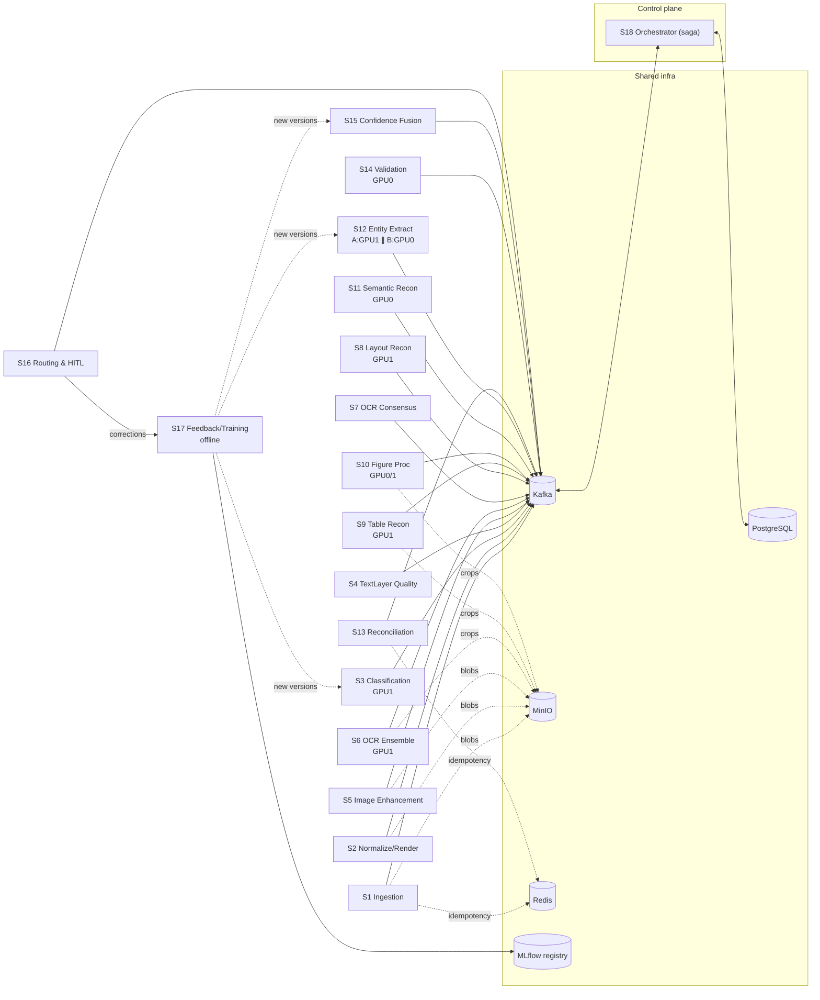
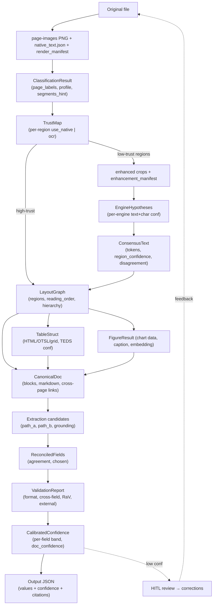
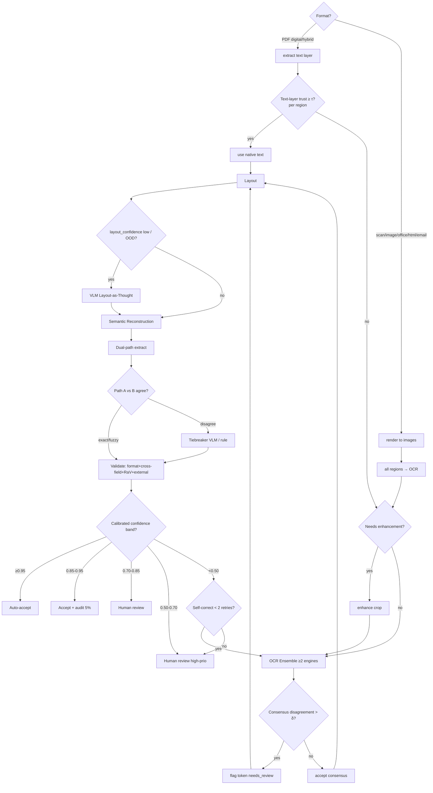
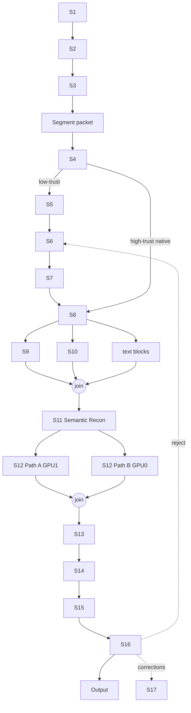
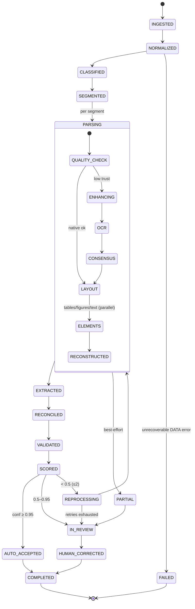

# Industrial IDP System — Architecture Review + Component Specification

**Author**: Principal AI Architect  
**Date**: 2026-07-08  
**Status**: FINAL (Part I = review; Part II = component spec; Part III = diagrams & contracts)  
**Contents**: Part I (§1–14) architecture review & air-gapped deployment · Part II (§15–16) detailed spec of 18 services · Part III (§17–24) service interaction, data flow, decision tree, DAG, lifecycle, per-stage JSON, API contracts.  
**Goal**: Maximum accuracy entity/metadata extraction from heterogeneous documents  
**Deployment constraint**: Air-gapped (no internet) on-prem server with **2×NVIDIA A100 40GB** (80GB total VRAM). No external APIs. See Section 14.

---

## 1. Critical Analysis of the Proposed Architecture

Your proposed pipeline:

```
Document → Classification → Text Quality → OCR → Layout → Tables → Semantic Reconstruction → Entity Extraction → Validation → Confidence Engine → Output
```

### 1.1 What Is Wrong Fundamentally

**The architecture is a linear pipeline. This is the single biggest flaw.**

Linear pipelines have a well-documented failure mode: **error cascading**. Every stage introduces errors that propagate irrecoverably downstream. In 2025-2026 research, this is the #1 cited limitation of multi-stage OCR systems:

> *"Pipeline systems decompose document parsing into layout detection, element-wise recognition, and rule-based assembly. They suffer from inter-stage error propagation and irreversible loss of visual context during text extraction."*  
> — Qianfan-OCR (Baidu, CVPR 2026)

> *"The cascaded structure of multiple models introduces inherent drawbacks, including error propagation and elevated development and maintenance overhead."*  
> — HunyuanOCR (Tencent, 2025)

**Concrete failure scenario**: Layout detection misclassifies a table as a text block → Table extraction is skipped entirely → Semantic reconstruction receives flat text instead of tabular data → Entity extraction hallucinates values from unstructured text. The error is invisible at output but catastrophic for accuracy.

### 1.2 Specific Stage Problems

| Stage | Problem |
|-------|---------|
| **Classification** | Premature classification commits the system to a single document type before understanding its content. Hybrid documents (invoice + contract terms + attachments) break this. |
| **Text Quality** | Binary "good/bad" quality assessment is insufficient. Quality varies by region within a single page. A page can have digital text in headers, scanned stamps, and handwritten signatures simultaneously. |
| **OCR** | Positioned as a single step — but which OCR? Different engines excel at different content: TrOCR for handwriting, PaddleOCR for printed text, Tesseract for clean digital. A single OCR pass is a guaranteed accuracy ceiling. |
| **Layout → Tables** | Sequential dependency is wrong. Layout and table extraction should happen jointly or with cross-feedback. Modern approaches (POTATR, PaddleOCR-VL) do both simultaneously. |
| **Semantic Reconstruction** | Vague, undefined stage. What does it actually do? Reading order? Paragraph assembly? Cross-page linking? This is where your pipeline needs the most specificity. |
| **Entity Extraction** | Single-model extraction is the weakest link for accuracy-critical systems. The 2026 state-of-the-art is **dual-model reconciliation** (specialist + VLM, see ExtractConf). |
| **Validation** | Rule-based validation cannot catch semantic errors. "The date is in the future" catches format errors but not "this invoice number doesn't exist." |
| **Confidence Engine** | Post-hoc confidence on a single extraction is unreliable. LLM confidence scores are systematically miscalibrated. Research shows raw confidence of 0.95 can correspond to actual accuracy of 0.70. |

---

## 2. What Is Outdated in the Proposed Architecture

### 2.1 Separate OCR as a Pipeline Stage (OUTDATED)

**2024 approach**: Dedicated OCR engine → text → downstream processing.

**2025-2026 approach**: VLMs that perform OCR-free document understanding, OR coarse-to-fine architectures that couple layout detection with element-level recognition in a single model.

Key evidence:
- **SmolDocling** (IBM, ICCV 2025): 256M parameter end-to-end VLM producing DocTags — no separate OCR stage at all.
- **PaddleOCR-VL** (Baidu, CVPR 2026): Coarse-to-fine architecture — RT-DETR for layout + 0.9B VLM for recognition. Layout and OCR are decoupled but NOT sequential pipeline stages.
- **HunyuanOCR** (Tencent, 2025): 1B end-to-end VLM, explicitly eliminating separate OCR.

The correct 2026 architecture treats OCR as **a capability embedded within the parsing model**, not a standalone pipeline stage.

### 2.2 Rule-Based Validation (OUTDATED)

Deterministic rules ("field X must be a date", "field Y must be numeric") miss:
- Semantically incorrect but syntactically valid extractions
- Cross-field inconsistencies (invoice total ≠ sum of line items)
- Hallucinated values that pass all format checks

**2026 approach**: LLM-driven validation with structured comparison (IDP Accelerator, 2026), or Reconstruction-as-Validation (RaV-IDP, 2026) where extracted data is rendered back to visual form and compared against the original document.

### 2.3 Single Confidence Score (OUTDATED)

A single confidence number per extraction is insufficient for production.

**2026 approach**: Multi-signal confidence:
- OCR region-level confidence
- Model logprob entropy
- Cross-model agreement/disagreement (Hunter-Mapper pattern from ExtractConf, 2026)
- Image quality scores
- Spatial layout coherence
- Post-hoc calibration (isotonic regression, ECE < 0.03)

---

## 3. Missing Stages

### 3.1 MISSING: Format Normalization & Multi-Resolution Rendering

Your architecture jumps from "Document" directly to "Classification." Missing: the critical conversion of heterogeneous inputs (DOCX, XLSX, PPTX, HTML, Email, TIFF) to a canonical page-image format at multiple resolutions. This stage determines the quality ceiling for everything downstream.

**Why it matters**: A DOCX rendered at 72 DPI produces garbage OCR. A TIFF at 600 DPI wastes GPU memory. Dynamic resolution — rendering at the native resolution the parsing model needs — is a key innovation in PaddleOCR-VL.

### 3.2 MISSING: Document Packet Segmentation

Real-world documents arrive as **packets** — a single PDF containing an invoice, a contract addendum, a W-9 form, and a handwritten note. Without segmentation, the system processes the entire packet as one document type.

**2026 approach**: DocSplit (IDP Accelerator, 2026) uses BIO tagging on page sequences to segment multi-document packets into constituent documents.

### 3.3 MISSING: Multi-Model Extraction with Reconciliation

Your architecture has a single "Entity Extraction" stage. For maximum accuracy, you need **two or more extraction approaches** that fail in different ways:

- **Specialist model** (LayoutLMv3, fine-tuned on your document type): Fast, stable, fails on OOD layouts
- **Frontier VLM** (Claude 3.5, GPT-4o, Qwen2.5-VL): Robust to layout variation, unstable across runs
- **Reconciliation engine**: When they agree → auto-accept. When they disagree → tiebreaker (third model, rules, or human)

Evidence: A top-3 EU bank achieved 99.2% accuracy at 4.1% manual review rate using dual-model reconciliation, vs. 96.8% with specialist alone or 94.5% with VLM alone.

### 3.4 MISSING: Self-Correcting / Iterative Extraction Loop

Your pipeline is single-pass. If the first extraction attempt fails, there's no recovery.

**2026 approach**: Agentic extraction with self-correction:
1. Extract → Validate → If confidence low → Reformulate prompt → Re-extract with different strategy
2. Reconstruction-as-Validation: Render extracted data back to image → Compare with original → If mismatch → Trigger fallback extractor

### 3.5 MISSING: Reading Order as a First-Class Stage

Reading order is mentioned nowhere in your pipeline, but it's one of the hardest problems in document understanding — especially for multi-column layouts, sidebars, footnotes, and cross-page tables.

PaddleOCR-VL uses a dedicated pointer network (6 transformer layers) specifically for reading order prediction. This is NOT a trivial sub-task of layout analysis.

### 3.6 MISSING: Human-in-the-Loop (HITL) Integration Point

For a system targeting maximum accuracy, there must be a structured HITL stage — not as an afterthought but as a first-class architectural component with:
- Configurable confidence thresholds per field type
- Role-based review (Admin vs Reviewer)
- Feedback loops that improve models over time

### 3.7 MISSING: Cross-Page Element Handling

Tables, paragraphs, and form sections that span multiple pages are a major blind spot. PubTables-v2 (2025) introduced the first large-scale benchmark for multi-page table extraction, showing that most models fail completely on tables spanning >2 pages.

---

## 4. Stages That Are Redundant

### 4.1 "Classification" as a Separate Upstream Stage

**Verdict: Merge into intelligent routing.**

A rigid classify-then-process pipeline fails on:
- Hybrid documents (invoice + contract + receipt in one file)
- Documents that don't fit predefined categories
- Multi-document packets

Instead: **Adaptive routing** — a lightweight classifier determines initial processing strategy, but the system can re-route mid-pipeline based on content discovered during parsing. This is the Adaptive RAG pattern applied to document processing.

### 4.2 "Text Quality" as a Standalone Stage

**Verdict: Embed as a signal, not a stage.**

Text quality is not binary and varies by region. Instead of a separate stage:
- OCR confidence scores per region serve as quality signals
- Image quality metrics (blur, skew, resolution) feed directly into the confidence engine
- The system should dynamically select OCR engines based on detected quality, not gate the entire pipeline

### 4.3 Separate "Tables" Stage After "Layout"

**Verdict: Merge with layout detection.**

Modern layout models (PP-DocLayoutV2, RT-DETR based) already detect and classify tables as part of layout analysis. A separate "Tables" stage implies re-detection. Table structure recognition (rows, columns, cells) should be triggered by layout detection output, not as an independent sequential stage.

---

## 5. Modern Approaches (2025-2026)

### 5.1 End-to-End VLMs Replacing Pipelines

| Model | Params | Approach | OmniDocBench Score |
|-------|--------|----------|-------------------|
| PaddleOCR-VL-1.6 | 0.9B | Coarse-to-fine (RT-DETR + VLM) | 96.33% |
| Qianfan-OCR | 4B | End-to-end + Layout-as-Thought | 93.12% |
| HunyuanOCR | 1B | End-to-end VLM | SOTA on multiple benchmarks |
| SmolDocling | 256M | End-to-end DocTags | Competitive with 27x larger models |
| GLM-OCR | 0.9B | Two-stage + Multi-Token Prediction | Competitive SOTA |

**Key insight**: The trend is NOT to replace pipelines with monolithic VLMs. It's to use **compact specialist VLMs** (0.25B–4B) in a coarse-to-fine architecture where layout detection and element recognition are decoupled but NOT sequentially pipelined.

### 5.2 Layout-as-Thought (Qianfan-OCR, 2026)

Instead of a separate layout analysis stage, the VLM generates layout reasoning as an optional "thinking" phase triggered by `<think>` tokens. The model produces bounding boxes, element types, and reading order BEFORE producing final content. This:
- Recovers layout analysis within the end-to-end paradigm
- Provides targeted accuracy improvements on complex layouts
- Eliminates inter-stage error propagation for layout

### 5.3 Structured Layout Priors (IBM, 2026)

Pre-resolve layout detection outside the VLM by running a lightweight RT-DETR detector, serializing its outputs in the parser's native DocTags vocabulary, and injecting them into the prompt alongside the full page image. Results:
- Markdown F1: 0.37 → 0.92 on OOD documents
- Table TEDS: 0.01 → 0.36 on Chinese documents
- Infinite-loop decoding failures: eliminated

### 5.4 Multi-Signal Confidence (ExtractConf, 2026)

The state-of-the-art confidence engine uses:
- **Hunter-Mapper dual-call design**: Same LLM, two structurally asymmetric prompts (field-guided vs. document-guided). Different failure modes make disagreement informative.
- **40 features**: OCR confidence, logprob entropy, spatial centroid divergence, image quality, cross-call agreement
- **CatBoost classifier** with post-hoc isotonic regression calibration
- **Result**: 0.928 ROC AUC, 99.1% accuracy at 80% coverage, zero-shot transfer across domains

### 5.5 Reconstruction-as-Validation (RaV-IDP, 2026)

After extraction, render the extracted representation back into a form comparable to the original document region. A comparator scores fidelity between reconstruction and source. Low fidelity → trigger fallback extractor.

### 5.6 Agentic Document Processing (IDP Accelerator, 2026)

Production IDP systems are moving toward **agentic architectures** where:
- The system autonomously decides which extraction strategy to use
- Self-corrects when validation fails
- Routes to specialized sub-processors based on discovered content
- Integrates HITL as a first-class component with MCP (Model Context Protocol)

---

## 6. What Enterprise IDP Systems Actually Use (2026)

### 6.1 Google Document AI
- Gemini Layout Parser for table recognition, reading order, context-aware chunking (GA May 2026)
- Few-shot and zero-shot extraction with Gemini 2.5/3 Pro
- CEL-based validation rules
- Specialized processors per document type

### 6.2 Azure Document Intelligence
- Pre-built models for 20+ document types
- Custom neural models trained on 5-20 samples
- Container deployment for on-premises
- Batch API for high-volume processing

### 6.3 LandingAI ADE
- Visual-first parsing with coordinate-level visual grounding
- 99.16% DocVQA accuracy
- Semantic chunking preserving document hierarchy
- Schema-based extraction with visual citations

### 6.4 Common Enterprise Patterns (2026)

1. **Dual-model reconciliation** — specialist + VLM, auto-accept on agreement
2. **Confidence-based routing** — high confidence → auto-process, low → human review
3. **Per-document-type calibration curves** — separate confidence models for invoices vs. contracts vs. forms
4. **Continuous feedback loops** — human corrections retrain extraction models
5. **Modular, swappable stages** — each stage independently replaceable without system redesign

---

## 7. Proposed New Architecture (From Scratch)

### 7.1 Design Principles

1. **No linear pipeline** — use a directed acyclic graph (DAG) with conditional routing
2. **Dual-path extraction** — always run two independent extractors and reconcile
3. **Multi-signal confidence** — never trust a single confidence score
4. **Self-correcting loops** — retry with different strategies on failure
5. **HITL as first-class** — not an afterthought
6. **Per-region processing** — different regions of the same page may need different strategies
7. **Swappable components** — every stage can be replaced without system redesign

### 7.2 Architecture Overview

```
┌─────────────────────────────────────────────────────────────────────┐
│                        DOCUMENT INTAKE                              │
│  ┌──────────┐  ┌──────────────┐  ┌─────────────┐                  │
│  │ Ingestion │→│ Format Norm  │→│ Multi-Res    │                  │
│  │ (queue)   │  │ (to images)  │  │ Rendering    │                  │
│  └──────────┘  └──────────────┘  └──────┬──────┘                  │
│                                         │                          │
└─────────────────────────────────────────┼──────────────────────────┘
                                          ▼
┌─────────────────────────────────────────────────────────────────────┐
│                    DOCUMENT UNDERSTANDING                            │
│                                                                     │
│  ┌────────────────────────────────────────────────────────────┐    │
│  │            Coarse-to-Fine Parsing (VLM-based)              │    │
│  │                                                            │    │
│  │  ┌─────────────┐    ┌──────────────┐    ┌──────────────┐  │    │
│  │  │ Packet Segm │───▶│ Layout Detect│───▶│ Reading Order│  │    │
│  │  │ (DocSplit)  │    │ (RT-DETR)    │    │ (Pointer Net)│  │    │
│  │  └─────────────┘    └──────┬───────┘    └──────┬───────┘  │    │
│  │                            │                    │          │    │
│  │                     ┌──────┴───────┐            │          │    │
│  │                     ▼              ▼            ▼          │    │
│  │              ┌──────────┐  ┌──────────┐  ┌──────────┐     │    │
│  │              │ Text     │  │ Table    │  │ Figure/  │     │    │
│  │              │ Region   │  │ Structure│  │ Chart/   │     │    │
│  │              │ OCR(VLM) │  │ (TATR/   │  │ Formula  │     │    │
│  │              │          │  │  VLM)    │  │ (VLM)    │     │    │
│  │              └──────────┘  └──────────┘  └──────────┘     │    │
│  │                     │              │            │          │    │
│  │                     └──────────────┴────────────┘          │    │
│  │                                  │                         │    │
│  │                          ┌───────▼───────┐                │    │
│  │                          │  Structured   │                │    │
│  │                          │  Document     │                │    │
│  │                          │  Representation│                │    │
│  │                          └───────────────┘                │    │
│  └────────────────────────────────────────────────────────────┘    │
│                                                                     │
└─────────────────────────────────────┬───────────────────────────────┘
                                      ▼
┌─────────────────────────────────────────────────────────────────────┐
│                    DUAL-PATH EXTRACTION                              │
│                                                                     │
│  ┌─────────────────────┐         ┌─────────────────────┐           │
│  │ Path A: Specialist  │         │ Path B: VLM         │           │
│  │ (LayoutLMv3 /       │         │ (Claude 3.5 /       │           │
│  │  fine-tuned model)  │         │  GPT-4o /           │           │
│  │                     │         │  Qwen2.5-VL)        │           │
│  │ - Schema-guided     │         │ - Prompt-driven     │           │
│  │ - Fast, stable      │         │ - Robust to layout  │           │
│  │ - Fails on OOD      │         │ - Fails inconsistently           │
│  └──────────┬──────────┘         └──────────┬──────────┘           │
│             │                               │                      │
│             └───────────┬───────────────────┘                      │
│                         ▼                                          │
│              ┌─────────────────────┐                               │
│              │  Reconciliation     │                               │
│              │  Engine             │                               │
│              │                     │                               │
│              │  Agreement → Accept │                               │
│              │  Disagree → Tiebreak│                               │
│              └──────────┬──────────┘                               │
│                         │                                          │
└─────────────────────────┼──────────────────────────────────────────┘
                          ▼
┌─────────────────────────────────────────────────────────────────────┐
│                    VALIDATION & CONFIDENCE                           │
│                                                                     │
│  ┌──────────────────────────────────────────────────────────┐      │
│  │              Multi-Signal Confidence Engine               │      │
│  │                                                          │      │
│  │  Signals:                                                │      │
│  │  ├── OCR region confidence                               │      │
│  │  ├── Model logprob entropy (both paths)                  │      │
│  │  ├── Cross-path agreement score                          │      │
│  │  ├── Image quality metrics                               │      │
│  │  ├── Spatial layout coherence                            │      │
│  │  ├── Reconstruction fidelity (RaV-IDP)                   │      │
│  │  └── Cross-field semantic consistency                    │      │
│  │                                                          │      │
│  │  Calibration: Isotonic regression per field type          │      │
│  │  Target: ECE < 0.03                                      │      │
│  └──────────────────────┬───────────────────────────────────┘      │
│                         │                                          │
│  ┌──────────────────────▼───────────────────────────────────┐      │
│  │              Validation Layer                             │      │
│  │                                                          │      │
│  │  ├── Format validation (deterministic)                   │      │
│  │  ├── Cross-field consistency (LLM-driven)                │      │
│  │  ├── External system validation (DB lookup, API)         │      │
│  │  └── Reconstruction-vs-source fidelity check             │      │
│  └──────────────────────┬───────────────────────────────────┘      │
│                         │                                          │
└─────────────────────────┼──────────────────────────────────────────┘
                          ▼
┌─────────────────────────────────────────────────────────────────────┐
│                    ROUTING & OUTPUT                                  │
│                                                                     │
│  ┌──────────────────────────────────────────────────────────┐      │
│  │              Confidence-Based Router                      │      │
│  │                                                          │      │
│  │  confidence ≥ 0.95  → AUTO-ACCEPT                        │      │
│  │  confidence ≥ 0.85  → AUTO-ACCEPT + AUDIT SAMPLE (5%)    │      │
│  │  confidence ≥ 0.70  → HUMAN REVIEW (normal priority)     │      │
│  │  confidence ≥ 0.50  → HUMAN REVIEW (high priority)       │      │
│  │  confidence < 0.50  → REJECT / REPROCESS                 │      │
│  └──────────────────────┬───────────────────────────────────┘      │
│                         │                                          │
│             ┌───────────┼───────────┐                              │
│             ▼           ▼           ▼                              │
│      ┌──────────┐ ┌──────────┐ ┌──────────┐                       │
│      │ Auto     │ │ Human    │ │ Reject / │                       │
│      │ Output   │ │ Review   │ │ Retry    │                       │
│      │          │ │ Queue    │ │ (self-   │                       │
│      │          │ │          │ │ correct) │                       │
│      └──────────┘ └────┬─────┘ └──────────┘                       │
│                        │                                          │
│                        ▼                                          │
│                 ┌──────────────┐                                   │
│                 │ Feedback     │                                   │
│                 │ Loop         │                                   │
│                 │ (retrain     │                                   │
│                 │  models)     │                                   │
│                 └──────────────┘                                   │
│                                                                     │
└─────────────────────────────────────────────────────────────────────┘
```

### 7.3 Decision Flow

```
Document Arrives
│
├── 1. INGEST: Accept from email/FTP/API/upload → persist to durable storage
│
├── 2. NORMALIZE: Convert to canonical format
│   ├── PDF (digital) → Extract native images + text layer
│   ├── PDF (scan) → Render pages at 300 DPI
│   ├── PDF (hybrid) → Extract digital text regions + render scan regions
│   ├── TIFF/PNG/JPG → Direct image
│   ├── DOCX → Render via LibreOffice to PDF → images
│   ├── XLSX → Parse native structure + render sheets as images
│   ├── PPTX → Render slides as images
│   ├── HTML → Render via headless browser to images
│   └── Email → Parse MIME → separate attachments → recurse
│
├── 3. SEGMENT (if multi-document): DocSplit BIO tagging
│   └── Single document → skip
│
├── 4. PARSE (Coarse-to-Fine):
│   ├── 4a. Layout Detection (RT-DETR / PP-DocLayoutV2)
│   │   → Bounding boxes + element types (text, table, figure, formula, signature, stamp, ...)
│   │
│   ├── 4b. Reading Order Prediction (Pointer Network)
│   │   → Ordered sequence of detected regions
│   │
│   ├── 4c. Per-Region Recognition:
│   │   ├── Text regions → Compact VLM OCR (PaddleOCR-VL-0.9B / SmolDocling)
│   │   ├── Table regions → Table structure recognition (TATR/POTATR) + cell OCR
│   │   ├── Figure/chart regions → VLM captioning + data extraction
│   │   ├── Formula regions → LaTeX/MathML recognition
│   │   ├── Signature regions → Signature detection + identity matching
│   │   └── Stamp/seal regions → Seal recognition
│   │
│   └── 4d. Assemble Structured Document Representation
│       → Markdown/JSON with bounding boxes, reading order, hierarchy
│
├── 5. EXTRACT (Dual-Path):
│   ├── Path A: Specialist model (LayoutLMv3, fine-tuned per document type)
│   │   → Schema-guided extraction, fast, stable
│   │
│   ├── Path B: Frontier VLM (Claude 3.5 / GPT-4o / Qwen2.5-VL)
│   │   → Prompt-driven extraction with structured output schema
│   │   → Includes Layout-as-Thought for complex layouts
│   │
│   └── Reconciliation:
│       ├── Exact match → Accept (high confidence)
│       ├── Fuzzy match (edit distance ≤ 2) → Accept with flag
│       ├── Numeric match (within tolerance) → Accept with flag
│       └── Disagreement → Tiebreaker (third model / rules / human)
│
├── 6. VALIDATE:
│   ├── Format validation (deterministic rules)
│   ├── Cross-field consistency (LLM-driven: total = sum of line items?)
│   ├── External validation (DB lookup, API check)
│   └── Reconstruction fidelity (RaV-IDP: render extracted → compare with source)
│
├── 7. CONFIDENCE:
│   ├── Compute multi-signal confidence per field
│   ├── Apply per-field-type calibration curves
│   └── Produce calibrated confidence score [0, 1]
│
├── 8. ROUTE:
│   ├── ≥ 0.95 → Auto-accept → Output
│   ├── 0.85–0.95 → Auto-accept + audit sample → Output
│   ├── 0.70–0.85 → Human review (normal) → Output
│   ├── 0.50–0.70 → Human review (high priority) → Output
│   └── < 0.50 → Self-correct loop:
│       ├── Reformulate extraction prompt
│       ├── Try alternative OCR engine
│       ├── Try different VLM
│       └── If still failing after 2 retries → Human review
│
└── 9. FEEDBACK LOOP:
    ├── Human corrections → Retrain specialist model
    ├── Confidence drift monitoring → Recalibrate
    └── New document types → Extend classifier + add calibration curves
```

---

## 8. Why This Architecture Is Better

### 8.1 Error Propagation Mitigation

| Your Architecture | New Architecture |
|---|---|
| Linear pipeline — errors cascade | DAG with dual-path extraction — errors caught at reconciliation |
| Single OCR pass — permanent error | Per-region OCR selection — best engine per content type |
| Single extraction — silent failures | Dual-path extraction — disagreement flags errors |
| Post-hoc validation — too late | Reconstruction-as-Validation — catches errors before output |

### 8.2 Accuracy Gains (Based on Published Benchmarks)

| Technique | Accuracy Improvement | Source |
|---|---|---|
| Dual-model reconciliation | +2.4% over best single model | EU bank invoice benchmark (2026) |
| Layout priors injection | F1: 0.37 → 0.92 on OOD docs | IBM Structured Layout Priors (2026) |
| Reconstruction-as-Validation | +38.1% failed table recovery | RaV-IDP (2026) |
| Multi-signal confidence | 99.1% accuracy at 80% coverage | ExtractConf (2026) |
| Coarse-to-fine parsing | 96.33% OmniDocBench (SOTA) | PaddleOCR-VL-1.6 (2026) |

### 8.3 Architectural Properties

1. **Resilience**: No single point of failure. If one extractor fails, the other catches it.
2. **Adaptability**: New document types require adding a calibration curve, not redesigning the pipeline.
3. **Observability**: Per-field confidence with component breakdown (OCR quality vs. extraction quality vs. layout quality).
4. **Scalability**: Each stage independently scalable. Layout detection on GPU, extraction via API, validation on CPU.
5. **Cost control**: Confidence-based routing means expensive VLM extraction only runs as Path B (or tiebreaker), not on every document.

---

## 9. Compromises and Trade-offs

### 9.1 Latency vs. Accuracy

Dual-path extraction roughly doubles extraction time. Mitigation:
- Run paths in parallel (not sequentially)
- Use specialist as primary, VLM only on low-confidence fields
- Cache extraction results for repeated document templates

### 9.2 Cost vs. Coverage

Frontier VLM extraction (GPT-4o) costs ~$0.008/page. Running it on every document is expensive. Mitigation:
- Use confidence from Path A to decide whether to run Path B
- For high-volume standard documents (invoices), specialist alone with high confidence threshold may suffice
- Reserve VLM for complex/variable documents

### 9.3 Complexity vs. Maintainability

The dual-path + reconciliation architecture is more complex to build and maintain than a linear pipeline. Mitigation:
- Modular design with clear interfaces between stages
- Each component independently testable and replaceable
- Comprehensive observability from day one

### 9.4 Model Dependency

Relying on frontier VLMs (Claude, GPT-4o) creates vendor dependency. Mitigation:
- Abstract extraction behind a provider interface
- Maintain open-source alternatives (Qwen2.5-VL, InternVL)
- Specialist model (LayoutLMv3) is self-hosted and vendor-independent

---

## 10. Remaining Potential Problems

### 10.1 Multi-Page Tables

Tables spanning 3+ pages remain extremely challenging. PubTables-v2 (2025) introduced the first benchmark showing most models fail on tables >2 pages. Current mitigation: page-boundary detection + cross-page merging, but this is an active research area.

### 10.2 Handwriting + Printed Text Mix

Documents mixing handwritten annotations with printed text require different OCR engines per region. Region-level routing adds complexity and potential misclassification.

### 10.3 Non-Latin Scripts and Complex Layouts

Right-to-left text (Arabic, Hebrew), vertical text (CJK), and mixed-script documents still challenge even state-of-the-art models. PaddleOCR-VL supports 109 languages but performance varies significantly.

### 10.4 Confidence Calibration Drift

Calibration curves degrade over time as document populations shift. Requires continuous monitoring and periodic recalibration (weekly ECE tracking, alerting at ECE > 0.03).

### 10.5 Hallucination in VLM Extraction

VLMs can hallucinate values that don't exist in the document. Reconstruction-as-Validation (RaV-IDP) mitigates but doesn't eliminate this. For high-stakes fields (invoice amounts, contract dates), external validation against business systems is essential.

### 10.6 Long Documents

Documents exceeding the VLM's context window (even with 131K extended context) require chunking strategies that may split semantically related sections. Gemini 1.5 Pro's million-token context or retrieval-augmented approaches are current mitigations.

---

## 11. Supporting Research and References

| Paper/Source | Year | Key Contribution |
|---|---|---|
| Qianfan-OCR (Baidu) | 2026 | End-to-end 4B VLM, Layout-as-Thought, OmniDocBench SOTA |
| PaddleOCR-VL-1.6 (Baidu) | 2026 | Coarse-to-fine 0.9B VLM, 96.33% OmniDocBench |
| SmolDocling (IBM) | 2025 | 256M end-to-end VLM, DocTags format, ICCV 2025 |
| HunyuanOCR (Tencent) | 2025 | 1B end-to-end VLM, XD-RoPE for spatial reasoning |
| GLM-OCR (Zhipu) | 2026 | 0.9B VLM with Multi-Token Prediction |
| Structured Layout Priors (IBM) | 2026 | RT-DETR priors injected into VLM prompt, F1: 0.37→0.92 |
| DocCogito | 2026 | Layout tower + Visual-Semantic Chain for grounded reasoning |
| POTATR / PubTables-v2 (Microsoft) | 2025-2026 | 29M page-level table extraction, GriTS 0.964 |
| TDATR (CVPR 2026) | 2026 | End-to-end table recognition with cell-level alignment |
| ExtractConf | 2026 | Hunter-Mapper dual-call confidence, 0.928 AUC, ECE 0.034 |
| RaV-IDP | 2026 | Reconstruction-as-Validation, +38.1% failed table recovery |
| IDP Accelerator (AWS) | 2026 | Agentic IDP with DocSplit, MCP, HITL, 98% accuracy |
| DISCO | 2026 | OCR pipelines vs VLMs: dual strategy for different doc types |
| GutenOCR | 2026 | Grounded OCR front-end with token-box alignment |
| Enterprise 7-Stage Architecture | 2026 | Canonical IDP pipeline (ingestion→normalization→layout→OCR→structure→extract→validate) |

---

## 12. Summary of Architectural Recommendations

1. **Replace linear pipeline with DAG** — conditional routing, parallel paths, self-correcting loops
2. **Eliminate standalone OCR stage** — use coarse-to-fine VLM architecture (layout detection + element-level recognition)
3. **Add dual-path extraction** — specialist + VLM with reconciliation
4. **Add multi-signal confidence** — Hunter-Mapper, OCR confidence, spatial coherence, reconstruction fidelity
5. **Add Reconstruction-as-Validation** — render extracted data back, compare with source
6. **Add document packet segmentation** — DocSplit for multi-document inputs
7. **Add cross-page element handling** — explicit support for multi-page tables and sections
8. **Make HITL first-class** — configurable thresholds, role-based review, feedback loops
9. **Per-field-type calibration** — separate confidence models for different extraction types
10. **Self-correcting retry loop** — reformulate + re-extract on low confidence, max 2 retries

---

## 13. Repository Architecture Diagram (Implementation Spec)

**Decision**: Diagram-as-code in **Mermaid**, embedded in `docs/architecture.md`, plus exported `SVG/PNG`. Chosen because it renders natively on GitHub/GitLab (visible as an image directly in the repo), is version-controlled and PR-reviewable, and exports to raster/vector images via `mermaid-cli`.

### 13.1 Implementation Tasks (for implementation-capable agent)

> Repo: `github.com/Zhilg/NEI.git`. These files must be committed into the tracked tree (NOT `.kilo/`, which is gitignored). That is why they are currently not visible in the repo.

1. Create `docs/architecture.md` containing the Mermaid source below (verbatim) plus the resource table (13.4).
2. (Recommended) Copy this full review into a tracked file `docs/architecture-review.md` so the analysis is versioned in the repo too.
3. Install mermaid-cli: `npm i -g @mermaid-js/mermaid-cli`.
4. Export images:
   - `mmdc -i docs/architecture.md -o docs/architecture.svg`
   - `mmdc -i docs/architecture.md -o docs/architecture.png -w 2400`
5. Embed in root `README.md`: ``.
6. **Commit & push**: `git add docs/ README.md && git commit -m "docs: add IDP architecture diagram and review" && git push origin HEAD`.
7. (Optional) Add a CI job that re-exports the image on change to `docs/architecture.md` so the picture never drifts from the source.

### 13.2 Mermaid Source (paste into `docs/architecture.md`)

```mermaid
flowchart TD
    classDef ingest fill:#e3f2fd,stroke:#1565c0,color:#0d47a1
    classDef parse fill:#e8f5e9,stroke:#2e7d32,color:#1b5e20
    classDef extract fill:#fff3e0,stroke:#ef6c00,color:#e65100
    classDef conf fill:#f3e5f5,stroke:#6a1b9a,color:#4a148c
    classDef route fill:#fce4ec,stroke:#c2185b,color:#880e4f
    classDef gpu fill:#ffebee,stroke:#c62828,color:#b71c1c

    A["📥 INGESTION<br/><b>Что:</b> приём + immutable-хранение<br/><b>Чем:</b> Kafka (on-prem) + MinIO/FS + PostgreSQL (all local)<br/><b>Ресурс:</b> CPU, локальная сеть<br/><b>Зачем:</b> идемпотентный вход, оригинал = источник истины"]:::ingest

    B["🔄 NORMALIZATION + MULTI-RES RENDER<br/><b>Чем:</b> PyMuPDF, pdf2image/Ghostscript, Pillow/OpenCV,<br/>LibreOffice, Playwright, extract-msg<br/><b>Ресурс:</b> CPU-bound, 8-16 vCPU pool<br/><b>Зачем:</b> разрешение задаёт потолок точности"]:::ingest

    C{"🔍 TEXT-LAYER TRUST CHECK<br/><b>Чем:</b> эвристики + Tesseract sample-cross-check<br/><b>Ресурс:</b> CPU<br/><b>Зачем:</b> решает 'битый/сдвинутый text layer'"}:::ingest

    D["✂️ PACKET SEGMENTATION<br/><b>Чем:</b> LayoutLMv3/Donut + BIO-tagging (DocSplit)<br/><b>Ресурс:</b> GPU1 (A100)<br/><b>Зачем:</b> инвойс+договор+W9 в одном файле"]:::parse

    subgraph PARSE["🧩 STAGE 3 — COARSE-TO-FINE PARSING"]
        direction TB
        E["📐 3a LAYOUT DETECTION<br/><b>Чем:</b> RT-DETR / PP-DocLayoutV2<br/><b>Ресурс:</b> GPU1 (A100), ~2GB, ~35ms/стр<br/><b>Зачем:</b> стабильные bbox без галлюцинаций"]:::gpu
        F["🔢 3b READING ORDER<br/><b>Чем:</b> Pointer Network (6 transformer layers)<br/><b>Ресурс:</b> GPU1 (shared)<br/><b>Зачем:</b> multi-column, sidebars, footnotes"]:::gpu
        G["🔤 Text → PaddleOCR-VL-0.9B / SmolDocling (GPU1, ~3GB)<br/>ИЛИ доверенный text-layer"]:::gpu
        H["📊 Table → TATR/POTATR (GPU1, &lt;1GB) + VLM ячейки<br/>GriTS 0.964"]:::gpu
        I["📈 Figure/Chart/Formula → PaddleOCR-VL / Nougat (GPU1)"]:::gpu
        J["✍️ Signature/Seal → детектор + seal-recognition (GPU1)"]:::gpu
        K["🗂️ 3d ASSEMBLY<br/><b>Чем:</b> Docling / DocTags → Markdown+JSON+bbox<br/><b>Зачем:</b> единый формат + грудинг для цитат"]:::parse
        E --> F
        F --> G & H & I & J
        G & H & I & J --> K
    end

    subgraph EXTRACT["🎯 STAGE 4 — DUAL-PATH EXTRACTION"]
        direction TB
        L["Path A: SPECIALIST<br/><b>Чем:</b> LayoutLMv3 fine-tuned<br/><b>Ресурс:</b> GPU1 (A100), ~40ms<br/>стабилен, слаб на OOD"]:::extract
        M["Path B: LOCAL VLM (air-gapped)<br/><b>Чем:</b> Qwen2.5-VL-32B AWQ, self-hosted vLLM<br/><b>Ресурс:</b> GPU0 (A100 40GB), TP=1<br/>+ Layout-as-Thought, устойчив к верстке"]:::extract
        N{"⚖️ RECONCILIATION<br/><b>Чем:</b> Stickler-компаратор (exact/fuzzy/numeric)<br/><b>Зачем:</b> расхождение = сигнал ошибки<br/>99.2% @ 4.1% review"}:::extract
        L --> N
        M --> N
    end

    subgraph CONF["📊 STAGE 5-6 — CONFIDENCE + VALIDATION"]
        direction TB
        O["🧮 MULTI-SIGNAL CONFIDENCE<br/><b>Чем:</b> Hunter-Mapper (reuse GPU0 VLM) + CatBoost (ExtractConf)<br/>OCR-conf, logprob-entropy (локальные!), agreement,<br/>image-quality, spatial, reconstruction-fidelity<br/><b>Калибровка:</b> isotonic, ECE<0.03"]:::conf
        P["✅ VALIDATION<br/><b>Чем:</b> rules + локальный LLM cross-field + local DB +<br/>Reconstruction-as-Validation (RaV-IDP)<br/><b>Зачем:</b> ловит галлюцинации до вывода"]:::conf
        O --> P
    end

    Q{"🚦 CONFIDENCE ROUTER"}:::route
    R["🟢 ≥0.95 AUTO-ACCEPT"]:::route
    S["🟡 0.85-0.95 ACCEPT + AUDIT 5%"]:::route
    T["🟠 0.50-0.85 HUMAN REVIEW<br/>(role-based portal)"]:::route
    U["🔴 <0.50 SELF-CORRECT LOOP<br/>reformulate/alt-OCR/alt-VLM, max 2 retry"]:::route
    V["📤 OUTPUT<br/>JSON/Markdown + confidence + bbox-citations"]:::route
    W["🔁 FEEDBACK LOOP<br/>corrections → retrain + recalibrate"]:::route

    A --> B --> C
    C -->|multi-doc| D
    C -->|single| E
    D --> E
    K --> L & M
    N --> O
    P --> Q
    Q --> R & S & T & U
    R & S --> V
    T --> V
    U -->|retry| E
    U -->|fail| T
    T --> W
    W -.retrain.-> L
    W -.recalibrate.-> O
```



### 13.3 Color Legend (stages)

| Color | Stage group |
|-------|-------------|
| Blue | Intake (ingestion, normalization, trust check) |
| Green | Parsing (segmentation, layout, assembly) |
| Red border | GPU-bound nodes (parsing stack → **GPU1**) |
| Orange | Dual-path extraction + reconciliation (Path B → **GPU0**) |
| Purple | Confidence + validation |
| Pink | Routing, output, feedback |

### 13.4 Resource Table (place under the diagram in `docs/architecture.md`)

| Стадия | Устройство | Модель/сервис | VRAM | Латентность/стр | Масштабирование |
|--------|------------|---------------|------|-----------------|-----------------|
| Ingestion | CPU | Kafka+MinIO+PostgreSQL (local) | — | ~50ms | горизонтальное (workers) |
| Normalize | 8-16 vCPU | PyMuPDF/LibreOffice/Playwright | — | ~80-800ms | CPU pool |
| Trust check | CPU | Tesseract | — | ~200ms | CPU |
| Segmentation | **GPU1** (A100 40GB) | LayoutLMv3 | ~2GB | ~50ms | GPU batch |
| Layout+Order | **GPU1** | RT-DETR/PP-DocLayoutV2 + Pointer | ~2GB | ~40ms | GPU batch |
| Recognition | **GPU1** | PaddleOCR-VL-0.9B | ~3GB | ~150-400ms | локальный vLLM |
| Table | **GPU1** | TATR/POTATR | <1GB | ~50-150ms | GPU batch |
| Path A (specialist) | **GPU1** | LayoutLMv3 fine-tuned | ~2GB | ~40ms | self-host |
| Path B (VLM) | **GPU0** (A100 40GB) | Qwen2.5-VL-32B AWQ, vLLM TP=1 | ~20GB веса + ~18GB KV | ~1-4s | self-host, только low-conf |
| Confidence | CPU (+ GPU0 reuse) | CatBoost + Hunter-Mapper на VLM | — | ~20ms + VLM-call | CPU |
| Validation | CPU (+ GPU0 reuse) | rules + local LLM + local DB + RaV | — | ~100ms + VLM-call | CPU |

> Латентность — ориентиры для 2×A100 40GB. Стоимости per-page нет (air-gapped, без API). Path B и Hunter-Mapper/валидация переиспользуют один VLM на GPU0 и запускаются выборочно (по низкой уверенности Path A) — это ключ к пропускной способности. GPU1 полностью отдан парсинг-стеку (~8GB суммарно, большой запас в 40GB).

### 13.5 Notes for Implementer

- Mermaid label text uses `<br/>` for line breaks and inline `<b>` tags; keep them — GitHub renders them.
- Do not exceed ~8 lines per node label or the diagram becomes unreadable; move detail to the resource table.
- If the diagram grows, split into two files: `docs/architecture.md` (high-level flow) and `docs/architecture-parsing.md` (Stage 3 detail).
- Regenerate `docs/architecture.svg` / `.png` whenever the Mermaid source changes (CI recommended).
- **Air-gap note**: mermaid-cli (Puppeteer/Chromium) must be installed offline on the build host, or export the images once on a connected build machine and commit the resulting `.svg/.png` to the repo. The runtime server needs no internet.

---

## 14. Air-Gapped Deployment on 2×A100 40GB

**Constraint**: On-prem server, **no internet**, 2×NVIDIA A100 40GB (80GB total VRAM). No external LLM/OCR APIs. All models, packages, and images provisioned offline.

### 14.1 GPU Budget (Variant A — dedicated per-GPU)

| Device | Workload | Models | VRAM |
|--------|----------|--------|------|
| **GPU0** (A100 40GB) | Extraction Path B + Hunter-Mapper confidence + LLM validation | Qwen2.5-VL-32B AWQ int4 (vLLM, TP=1) | ~20GB weights + ~18GB KV-cache |
| **GPU1** (A100 40GB) | Full parsing stack (isolated from extraction) | RT-DETR/PP-DocLayoutV2 (~2GB) + Pointer Net + PaddleOCR-VL-0.9B (~3GB) + TATR/POTATR (<1GB) + LayoutLMv3 Path A (~2GB) | ~8GB used, ~32GB headroom |
| **CPU** | Confidence classifier, orchestration, rendering | CatBoost, PyMuPDF, LibreOffice, Tesseract | RAM |

Rationale: physical isolation of the extraction VLM from the parsing pipeline → no memory contention, large KV-cache on GPU0 (long multi-page context in a single pass), simple and robust ops. Ceiling is 32B (72B does not fit on a single 40GB card).

### 14.2 Model Choices (all open-weights, air-gap compatible)

- **Primary VLM (Path B / confidence / validation)**: Qwen2.5-VL-32B-Instruct (AWQ/GPTQ int4).
- **Parsing recognition**: PaddleOCR-VL-0.9B (or SmolDocling-256M for lighter footprint).
- **Layout**: RT-DETR / PP-DocLayoutV2. **Reading order**: Pointer Network.
- **Tables**: TATR / POTATR (non-VLM, outperforms domain VLMs on TSR).
- **Path A specialist**: LayoutLMv3 fine-tuned per document type.
- **Alternatives if 32B is too heavy or for redundancy**: InternVL2, HunyuanOCR-1B, Qianfan-OCR-4B.

### 14.3 Offline Provisioning (build/transfer checklist)

1. **Model weights**: download all HF checkpoints on a connected machine → transfer to server → local model dir.
2. **Offline flags at runtime**: `HF_HUB_OFFLINE=1`, `TRANSFORMERS_OFFLINE=1`, `HF_DATASETS_OFFLINE=1`.
3. **Python deps**: build a wheelhouse (`pip download`) or run a private PyPI mirror (devpi/Nexus); install with `--no-index --find-links`.
4. **Containers**: pull and `docker save` images (vLLM, PaddleOCR, app) → `docker load` on server, or push to a local registry (Harbor).
5. **System packages**: LibreOffice, Ghostscript, Tesseract + language packs, Chromium (for Playwright) — provision via offline apt mirror or bundled `.deb`.
6. **Telemetry off**: disable vLLM usage stats (`VLLM_NO_USAGE_STATS=1` / `DO_NOT_TRACK=1`), HF telemetry (`HF_HUB_DISABLE_TELEMETRY=1`), pip version check; block all egress at firewall.

### 14.4 Local Infrastructure (replaces cloud services)

| Cloud (original) | Air-gapped replacement |
|---|---|
| S3 | MinIO or local filesystem |
| SQS/Kafka | self-hosted Kafka / RabbitMQ |
| Managed DB | on-prem PostgreSQL |
| API LLM (Claude/GPT-4o) | self-hosted vLLM (Qwen2.5-VL-32B) |
| Cloud OCR (Textract/Doc AI) | PaddleOCR-VL + TATR (local) |

### 14.5 Serving & Concurrency Notes

- Serve the VLM via **vLLM** with `--gpu-memory-utilization` tuned so KV-cache fits multi-page documents; pin to GPU0 (`CUDA_VISIBLE_DEVICES=0`).
- Pin the parsing stack to GPU1 (`CUDA_VISIBLE_DEVICES=1`); load small models once and keep resident (avoid reload churn).
- Goal is accuracy, not latency → batch processing acceptable; queue documents through Kafka, process with bounded concurrency to respect VRAM.
- Hunter-Mapper (2 asymmetric prompts) and RaV validation reuse the same GPU0 VLM via sequential calls; account for their added VLM calls in throughput planning.

### 14.6 Dual-Path Still Applies (air-gapped)

Both extraction paths are now local models with different failure modes: Path A (LayoutLMv3 — stable, weak on OOD layouts) and Path B (Qwen2.5-VL-32B — robust to layout variation, less deterministic). Reconciliation of their disagreement remains the primary accuracy lever; no internet dependency.

### 14.7 Upgrade Option

If a benchmark on real production documents shows a material accuracy gain, upgrade the primary VLM to **72B AWQ with TP=2** (Variant B). Trade-off: parsing stack and KV-cache become memory-constrained, ops complexity increases (tensor-parallel + co-residency). Only adopt after measured justification.

---

# PART II — DETAILED COMPONENT SPECIFICATION

> **Audience**: 20 senior engineers. **Status**: architecture APPROVED — this section is the build spec.
> **Deployment**: air-gapped, 2×A100 40GB, Variant A. All models local. No external APIs.

## 15. Global Conventions

### 15.1 Service Topology

- **Communication**: two planes.
  - **Control/data plane (async)**: Apache Kafka topics. Each service consumes from an input topic, produces to an output topic. This is the primary orchestration mechanism (event-driven DAG).
  - **Sync plane (request/response)**: gRPC for GPU inference services (low-latency, binary, streaming); REST/JSON for control APIs (HITL portal, admin, health).
- **Blob storage**: MinIO (S3-compatible) for page images, crops, intermediate artifacts. Kafka messages carry **references** (object keys), never large binaries.
- **State store**: PostgreSQL — canonical document state, per-stage results index, audit log. Redis — caches, idempotency keys, distributed locks.
- **Artifact model**: every stage writes an immutable `StageResult` blob to MinIO keyed by `{doc_id}/{stage}/{version}.json` and an index row to PostgreSQL. Nothing is mutated in place — reprocessing creates a new version.

### 15.2 Common Envelope (every Kafka message)

```json
{
  "envelope_version": "1.0",
  "message_id": "uuid",
  "doc_id": "uuid",
  "segment_id": "uuid|null",
  "page_range": [1, 12],
  "stage": "ocr_ensemble",
  "attempt": 1,
  "trace_id": "w3c-traceparent",
  "produced_at": "2026-07-08T11:00:00Z",
  "producer": "ocr-ensemble@v2.3.1",
  "payload_ref": "s3://idp/{doc_id}/ocr_ensemble/v1.json",
  "payload_inline": null,
  "priority": "normal",
  "sla_deadline": "2026-07-08T11:05:00Z"
}
```

### 15.3 Common Confidence Model

- Every extracted unit (char span, cell, region, field) carries `confidence ∈ [0,1]` PLUS the **raw signals** used to derive it (so downstream Confidence Fusion can re-weight).
- Confidence is always **calibrated** per stage against held-out ground truth (isotonic regression); raw model scores are stored separately as `raw_confidence`.
- Target calibration: **ECE < 0.03** per stage, monitored weekly.

### 15.4 Common Error / Retry / Fallback Semantics

- **Error classes**: `TRANSIENT` (GPU OOM, timeout, queue backpressure) → retry; `DATA` (corrupt input, unsupported codec) → dead-letter, no retry; `MODEL` (inference produced invalid schema) → fallback model then dead-letter; `POISON` (repeated crash) → quarantine topic + alert.
- **Retry**: exponential backoff with jitter, `base=2s`, `max=60s`, `max_attempts=3` (per-service override). Idempotency key = `{doc_id}:{stage}:{content_hash}` in Redis prevents duplicate side effects.
- **Dead-letter**: `dlq.{stage}` topic; DLQ consumer surfaces to ops dashboard + HITL as needed.
- **Circuit breaker**: per downstream model server (open after N consecutive failures → route to fallback → half-open probe).

### 15.5 Common Observability

- **Logging**: structured JSON logs (level, `trace_id`, `doc_id`, `stage`, `attempt`, `latency_ms`, `model_version`, `outcome`). Shipped to Loki. No document content in logs (PII) — only refs and hashes.
- **Tracing**: OpenTelemetry, W3C `traceparent` propagated through envelope. One trace = one document journey across all services.
- **Metrics**: Prometheus. Every service exports RED (Rate, Errors, Duration) + domain metrics (below). Grafana dashboards per service + one global "document funnel".
- **Model registry**: MLflow (offline mode) tracks model versions, calibration curves, eval metrics; models pinned by digest.

### 15.6 Service Catalog

| # | Service | GPU | Kafka in → out |
|---|---------|-----|----------------|
| S1 | Ingestion | — | `ingest.raw` → `pipeline.normalize` |
| S2 | Format Normalization & Rendering | CPU | `pipeline.normalize` → `pipeline.classify` |
| S3 | Document Classification | GPU1 | `pipeline.classify` → `pipeline.segment` |
| S4 | Text Layer Quality Estimator | CPU | `pipeline.segment` → `pipeline.enhance`/`pipeline.ocr` |
| S5 | Image Enhancement | CPU/GPU1 | `pipeline.enhance` → `pipeline.ocr` |
| S6 | OCR Ensemble | GPU1 | `pipeline.ocr` → `pipeline.ocr_consensus` |
| S7 | OCR Consensus | CPU | `pipeline.ocr_consensus` → `pipeline.layout` |
| S8 | Layout Reconstruction | GPU1 | `pipeline.layout` → `pipeline.tables`/`figures`/`semantic` |
| S9 | Table Reconstruction | GPU1 | `pipeline.tables` → `pipeline.semantic` |
| S10 | Figure Processing | GPU1 | `pipeline.figures` → `pipeline.semantic` |
| S11 | Semantic Reconstruction | CPU/GPU0 | `pipeline.semantic` → `pipeline.extract` |
| S12 | Entity Extraction (dual-path) | GPU0+GPU1 | `pipeline.extract` → `pipeline.reconcile` |
| S13 | Reconciliation | CPU | `pipeline.reconcile` → `pipeline.validate` |
| S14 | Validation Engine | CPU/GPU0 | `pipeline.validate` → `pipeline.confidence` |
| S15 | Confidence Fusion | CPU | `pipeline.confidence` → `pipeline.route` |
| S16 | Routing & HITL | — | `pipeline.route` → `pipeline.output`/`hitl.review` |
| S17 | Feedback/Training | offline | `hitl.corrections` → model registry |
| S18 | Orchestrator | — | control-plane (saga, timeouts, DAG edges) |

---

## 16. Service Specifications

> Each service follows the same 16-field template. `⭐` = expanded per request.

### S1 — Ingestion Service

- **Назначение**: единая точка приёма документов (watched folder / SFTP drop / internal upload API), присвоение `doc_id`, неизменяемое хранение оригинала, старт саги.
- **Входные данные**: сырой файл (bytes) + метаданные источника (channel, sender, received_at).
- **Выходные данные**: `doc_id`, объект-оригинал в MinIO `raw/{doc_id}/original.{ext}`, событие в `pipeline.normalize`.
- **Внутренний алгоритм**: (1) стрим в MinIO с вычислением SHA-256; (2) дедуп по хэшу (Redis SETNX) — идентичный файл возвращает существующий `doc_id`; (3) MIME-sniffing (libmagic) + верификация расширения; (4) запись строки в `documents` (state=`INGESTED`); (5) emit envelope.
- **Используемые модели**: нет (детерминированный сервис).
- **Альтернативные модели**: —.
- **Форматы данных**: вход — любой из поддерживаемых (PDF/TIFF/PNG/JPG/DOCX/XLSX/PPTX/HTML/EML/MSG); выход — оригинал + JSON-envelope.
- **Confidence score**: `ingest_confidence` = 1.0, кроме случая MIME/extension mismatch → 0.5 + флаг `mime_mismatch`.
- **Возможные ошибки**: `DATA` (файл 0 байт, битый контейнер), `TRANSIENT` (MinIO недоступен), `POISON` (превышен лимит размера, напр. >500MB/2000 стр).
- **Retry strategy**: только `TRANSIENT` (MinIO/Kafka) — 3 попытки, backoff. `DATA` → сразу DLQ `dlq.ingest`.
- **Fallback strategy**: при недоступности MinIO — временный запис на локальный WAL-диск, дренаж при восстановлении.
- **Caching**: дедуп-кэш `sha256 → doc_id` (Redis, TTL 7 дней).
- **Логирование**: `doc_id`, `sha256`, `source_channel`, `size`, `mime`, `dedup_hit`.
- **Мониторинг**: ingest rate, dedup ratio, MinIO write latency, DLQ rate.
- **Метрики качества**: % успешно принятых, % mime_mismatch, % дублей.
- **API между сервисами**: REST `POST /v1/documents` (upload) → `{doc_id}`; Kafka producer `pipeline.normalize`.

### S2 — Format Normalization & Rendering Service

- **Назначение**: привести любой формат к каноническому набору: (a) page-images в нужном разрешении, (b) сохранённый нативный текстовый слой + координаты (где есть), (c) нативная структура для office-форматов.
- **Входные данные**: envelope + ref на оригинал.
- **Выходные данные**: per-page PNG (`pages/{doc_id}/{n}.png`), `native_text.json` (текст+bbox из PDF/DOCX), `render_manifest.json` (dpi, размеры, кол-во страниц, source_type).
- **Внутренний алгоритм**:
  1. Роутинг по типу: PDF→PyMuPDF (extract text layer + embedded images + render @ target DPI); scan-PDF→pdf2image/Ghostscript @300 DPI; image→Pillow/OpenCV; DOCX/PPTX→LibreOffice headless→PDF→render; XLSX→openpyxl (структура) + render листов; HTML→Playwright screenshot + DOM; EML/MSG→парсинг MIME, извлечение тела + рекурсия по вложениям (каждое вложение → новый `doc_id` с `parent_doc_id`).
  2. Определение целевого DPI: адаптивно (мелкий шрифт → 300–400 DPI) на основе первичной оценки плотности текста.
  3. Нормализация цветового пространства, ориентации (EXIF), удаление alpha.
- **Используемые модели**: нет (rendering); опц. лёгкий orientation-classifier (доля градусов) — MobileNet-tiny.
- **Альтернативные модели**: orientation через Tesseract OSD.
- **Форматы данных**: вход — оригинал; выход — PNG (RGB, без alpha), JSON.
- **Confidence score**: `render_confidence` — по успешности рендера каждой страницы (1.0 полный успех; <1.0 если часть страниц не отрендерилась).
- **Возможные ошибки**: `DATA` (зашифрованный PDF без пароля, битый DOCX), `TRANSIENT` (LibreOffice worker crash), `MODEL` (—).
- **Retry strategy**: `TRANSIENT` 3× ; LibreOffice в отдельном sandbox-процессе с таймаутом 60s, kill+retry.
- **Fallback strategy**: PDF не парсится PyMuPDF → рендер через Ghostscript как скан → downstream пойдёт по OCR-ветке; office не конвертируется LibreOffice → рендер через альтернативный конвертер (unoconv) или пометка `render_failed` + HITL.
- **Caching**: рендер кэшируется по `sha256(original)+dpi` (MinIO) — повторная обработка бесплатна.
- **Логирование**: source_type, page_count, target_dpi, per-format renderer, fallback_used.
- **Мониторинг**: pages/sec, renderer error rate по типам, LibreOffice pool saturation.
- **Метрики качества**: % страниц с успешным рендером, среднее отклонение DPI от оптимального.
- **API**: gRPC `Render(doc_ref) → render_manifest` (для синхронных нужд); Kafka `pipeline.classify`.

### S3 — Document Classification ⭐

- **Назначение**: определить (a) тип документа per-страница и per-документ (invoice, contract, form, letter, report, ID, ...), (b) вероятность мультидокументного пакета и точки разбиения, (c) выбрать downstream-профиль обработки (какие экстракторы/схемы применять). Это **адаптивный роутер**, а не жёсткий гейт.
- **Входные данные**: page-images + `native_text.json` + `render_manifest`.
- **Выходные данные**:
  ```json
  {
    "doc_id": "…",
    "page_labels": [{"page":1,"type":"invoice","p":0.94,"bio":"B-invoice"},
                    {"page":2,"type":"invoice","p":0.90,"bio":"I-invoice"},
                    {"page":3,"type":"contract","p":0.88,"bio":"B-contract"}],
    "doc_type": "packet",
    "segments_hint": [{"range":[1,2],"type":"invoice"},{"range":[3,7],"type":"contract"}],
    "processing_profile": "profile.invoice_v3",
    "confidence": 0.91
  }
  ```
- **Внутренний алгоритм**:
  1. **Мультимодальный энкодер** страницы: изображение (низкое разрешение, ~224–512px) + топ-N токенов native_text → LayoutLMv3/Donut-classifier → эмбеддинг страницы.
  2. **Sequence labeling (BIO)** поверх последовательности страниц (BiLSTM/Transformer head) → границы документов внутри пакета (это вход для S-сегментации, здесь только hint).
  3. **Классификация типа** на уровне страницы (softmax по таксономии типов) + агрегация в тип документа/сегмента.
  4. **Выбор профиля**: маппинг type→processing_profile (какие схемы полей, какие валидаторы, какой extractor prompt).
  5. **OOD-детекция**: если max softmax < τ или энергия/Mahalanobis-скор выше порога → `type=unknown` → профиль `generic` + флаг для HITL.
- **Используемые модели**: LayoutLMv3 (fine-tuned классификатор, GPU1). Таксономия конфигурируема (YAML).
- **Альтернативные модели**: Donut-classifier (OCR-free) для случаев с плохим/отсутствующим текстовым слоем; DiT (Document Image Transformer) как vision-only fallback; zero-shot через Qwen2.5-VL (GPU0) для unknown-типов.
- **Форматы данных**: вход JSON+PNG; выход JSON (см. выше).
- **Confidence score**: `class_confidence` = калиброванная (isotonic) вероятность выбранного типа; отдельно `segmentation_confidence` для BIO-границ. Per-page и aggregate.
- **Возможные ошибки**: `MODEL` (невалидный выход, NaN), `DATA` (пустая страница). Смысловые: misclassification, пропущенная граница пакета.
- **Retry strategy**: `MODEL`/`TRANSIENT` — 2 попытки на primary, затем fallback-модель.
- **Fallback strategy**: low-confidence или OOD → (1) zero-shot VLM классификация; (2) если всё ещё низко → profile=`generic` (запускает максимально общий парсинг) + маршрут в HITL на подтверждение типа.
- **Caching**: эмбеддинги страниц кэшируются (Redis/MinIO) по хэшу изображения — ускоряет реклассификацию при смене таксономии.
- **Логирование**: page_labels, doc_type, profile, ood_flag, model_version, fallback_used.
- **Мониторинг**: распределение предсказанных типов (drift-детекция), % OOD, доля fallback, средняя max-softmax.
- **Метрики качества**: per-class precision/recall/F1, confusion matrix (по HITL-разметке), packet-boundary F1, OOD detection AUROC, ECE калибровки.
- **API**: gRPC `Classify(pages, native_text) → ClassificationResult`; Kafka `pipeline.segment`. Публикует `processing_profile`, который читают S11/S12/S14.

### S4 — Text Layer Quality Estimator ⭐

- **Назначение**: решить, **можно ли доверять встроенному текстовому слою** (per-region), и направить каждый регион либо на «взять native text», либо на OCR. Прямо решает проблему «битый/сдвинутый/посимвольный/мусорный текст PDF».
- **Входные данные**: `native_text.json` (спаны+bbox+шрифты), page-images, `render_manifest`.
- **Выходные данные**:
  ```json
  {
    "page": 1,
    "global_trust": 0.32,
    "decision": "ocr_required",
    "regions": [
      {"bbox":[..],"trust":0.95,"decision":"use_native","reason":"clean"},
      {"bbox":[..],"trust":0.10,"decision":"ocr","reason":"cid_garbage"}
    ]
  }
  ```
- **Внутренний алгоритм** (набор детекторов → взвешенная агрегация):
  1. **Coverage**: доля площади страницы, покрытая текстовыми боксами vs визуально «чернильные» пиксели (OpenCV connected components). Низкое покрытие при высокой чернильности → скан без слоя.
  2. **Garbage/CID-детекция**: доля символов вне ожидаемых юникод-диапазонов, `(cid:NN)` глифы, аномальная энтропия n-грамм, доля непечатаемых.
  3. **Geometry sanity**: боксы вне страницы, нулевой размер, перекрытия, посимвольная разбивка (каждый символ = отдельный спан).
  4. **Vision cross-check**: быстрый Tesseract-проход по K случайным строкам → CER(native, ocr_sample). CER>15% → слой недоверенный.
  5. **Language plausibility**: лёгкая LID + словарное покрытие.
  6. Взвешенная логистическая модель → `trust ∈ [0,1]` per-region; порог → decision.
- **Используемые модели**: Tesseract (sample cross-check), lightweight LID (fastText-compact), логистический агрегатор (обучен на размеченных «good/broken» PDF).
- **Альтернативные модели**: PaddleOCR quick-pass вместо Tesseract; GNN по геометрии боксов (research-tier).
- **Форматы данных**: JSON in/out.
- **Confidence score**: сам `trust` — это и есть confidence слоя; отдаётся в Confidence Fusion как сигнал `text_layer_trust`.
- **Возможные ошибки**: `DATA` (нет текстового слоя вообще → тривиально decision=ocr), `TRANSIENT` (Tesseract worker).
- **Retry strategy**: cross-check best-effort; при недоступности Tesseract — пропустить его сигнал, решать по остальным (degraded mode).
- **Fallback strategy**: при неопределённости (`trust≈порог`) — **безопасный выбор в сторону OCR** (не доверяем сомнительному слою; цель — точность).
- **Caching**: результат по `sha256(page)+native_hash`.
- **Логирование**: global_trust, per-region decisions distribution, CER_sample, garbage_ratio.
- **Мониторинг**: доля страниц ocr_required, средний CER cross-check, распределение trust.
- **Метрики качества**: точность decision против ground-truth (там где есть и слой, и OCR, и эталон); корреляция trust↔фактический CER.
- **API**: gRPC `EstimateTrust(native_text, pages) → TrustMap`; Kafka route: high-trust регионы → `pipeline.layout` (native text), low-trust → `pipeline.enhance`→`pipeline.ocr`.

### S5 — Image Enhancement ⭐

- **Назначение**: максимизировать OCR-точность для регионов, идущих на OCR: дескью, деварпинг, денойз, бинаризация, супер-резолюция мелкого текста, удаление фона/шума печатей.
- **Входные данные**: page-images + список low-trust регионов (bbox) от S4.
- **Выходные данные**: enhanced-кропы `enhanced/{doc_id}/{page}/{region}.png` + `enhancement_manifest.json` (какие операции применены, параметры, before/after quality score).
- **Внутренний алгоритм** (конвейер, каждый шаг условный по метрике качества):
  1. **Deskew**: Hough/Radon оценка угла → поворот.
  2. **Dewarp** (для фото/сканов книг): модель геометрической коррекции (DocUNet-style) — опц.
  3. **Denoise / despeckle**: OpenCV (fastNlMeans), морфология.
  4. **Binarization**: адаптивная (Sauvola) для печатного текста; пропускается для цветных/фото-регионов.
  5. **Super-resolution**: если высота строки < N px → Real-ESRGAN/SwinIR ×2–×4 (GPU1) только для текстовых кропов.
  6. **Illumination/shadow correction** для мобильных фото.
  7. Каждый шаг оценивается no-reference quality metric; шаг откатывается, если ухудшил метрику (guardrail).
- **Используемые модели**: Real-ESRGAN или SwinIR (super-res, GPU1); DocUNet/GeoTr (dewarp) — опционально; классические CV — без моделей.
- **Альтернативные модели**: SR — BSRGAN/HAT; dewarp — DewarpNet; denoise — DnCNN.
- **Форматы данных**: PNG in/out + JSON manifest.
- **Confidence score**: `enhancement_gain` = Δ(no-reference quality) до/после; не «уверенность», а сигнал для Fusion (`image_quality`).
- **Возможные ошибки**: `TRANSIENT` (GPU OOM на SR больших кропов → тайлинг), `MODEL` (SR артефакты).
- **Retry strategy**: OOM → уменьшить тайл/батч, retry; иначе пропустить SR.
- **Fallback strategy**: любой шаг, ухудшивший качество → откат к предыдущему изображению; при полном отказе SR → OCR по оригинальному кропу (никогда не блокируем pipeline).
- **Caching**: по `sha256(region)+pipeline_params`.
- **Логирование**: applied_ops, angles, sr_factor, quality_before/after, rollbacks.
- **Мониторинг**: доля регионов с SR, средний gain, GPU util, откаты.
- **Метрики качества**: Δ CER на OCR до/после enhancement (A/B на размеченном наборе) — главный KPI; no-reference IQ (BRISQUE/NIQE).
- **API**: gRPC `Enhance(region_crops) → enhanced_crops`; Kafka `pipeline.ocr`.

### S6 — OCR Ensemble ⭐

- **Назначение**: для каждого low-trust региона получить текст+координаты+per-char confidence от **нескольких независимых OCR-движков**, чтобы затем консенсусом снизить ошибку. Разные движки ошибаются по-разному.
- **Входные данные**: enhanced-кропы (или оригинальные, если enhancement пропущен) + метаданные региона (тип: printed/handwritten/mixed, язык-хинт от S3/S4).
- **Выходные данные**: на каждый регион — массив гипотез от каждого движка:
  ```json
  {
    "region_id":"…","engines":[
      {"engine":"paddleocr-vl","text":"Total: 1234.56","conf":0.97,
       "chars":[{"c":"1","bbox":[..],"p":0.99}, …],"lang":"en"},
      {"engine":"trocr","text":"Total: 1234,56","conf":0.88,"chars":[…]},
      {"engine":"tesseract","text":"Tota1: 1234.56","conf":0.71,"chars":[…]}
    ]
  }
  ```
- **Внутренний алгоритм**:
  1. **Engine routing** по типу региона: printed→PaddleOCR-VL-0.9B (primary) + Tesseract5 (cheap diverse); handwritten/degraded→TrOCR; CJK/multilingual→PaddleOCR-VL (109 языков). Минимум 2 движка на регион, до 3 для критичных полей.
  2. Параллельный inference (GPU1 pool через vLLM/triton для VL-движка; CPU для Tesseract).
  3. Нормализация выходов к единой схеме (текст + char-level boxes + confidence). Движки без char-conf получают оценку через эвристику.
  4. Пер-движковая калибровка confidence (isotonic на движок).
- **Используемые модели**: PaddleOCR-VL-0.9B (primary, GPU1), Tesseract 5 (CPU), TrOCR-base/large (рукопись, GPU1).
- **Альтернативные модели**: SmolDocling-256M, GOT-OCR2.0, HunyuanOCR-1B, EasyOCR; для формул — Nougat.
- **Форматы данных**: PNG in; JSON (per-engine hypotheses) out.
- **Confidence score**: per-engine, per-char, per-line calibrated confidence; агрегация — в S7.
- **Возможные ошибки**: `TRANSIENT` (GPU OOM, движок timeout), `MODEL` (пустой/битый выход одного движка).
- **Retry strategy**: падение одного движка не блокирует — консенсус считается по выжившим (min 1). Timeout движка → его гипотеза помечается missing.
- **Fallback strategy**: если primary (PaddleOCR-VL) недоступен → Tesseract+TrOCR; если все GPU-движки недоступны → Tesseract-only (degraded, флаг низкой уверенности).
- **Caching**: по `sha256(crop)+engine_version` — идемпотентно, дорого, кэш обязателен.
- **Логирование**: engines_run, per-engine latency/conf, missing_engines.
- **Мониторинг**: per-engine availability, latency p50/p99, GPU util, средняя per-engine confidence, drift.
- **Метрики качества**: per-engine CER/WER на эталоне; вклад каждого движка в итоговый консенсус (ablation).
- **API**: gRPC streaming `Recognize(region) → EngineHypotheses`; Kafka `pipeline.ocr_consensus`.

### S7 — OCR Consensus ⭐

- **Назначение**: слить гипотезы нескольких движков в **единый наиболее вероятный текст** с надёжной per-token уверенностью; пометить разногласия для ревью.
- **Входные данные**: per-region массив engine-гипотез (S6).
- **Выходные данные**: консенсусный текст региона + per-token confidence + флаги разногласий:
  ```json
  {"region_id":"…","text":"Total: 1234.56","method":"weighted_rover",
   "tokens":[{"t":"Total","p":0.99,"agree":3},{"t":"1234.56","p":0.93,"agree":2,
     "alts":[{"t":"1234,56","engines":["trocr"]}]}],
   "region_confidence":0.95,"disagreement":0.07}
  ```
- **Внутренний алгоритм**:
  1. **Alignment**: character/token-level multiple sequence alignment гипотез (ROVER-подобный, с учётом bbox для якорения).
  2. **Voting**: взвешенное голосование, вес = калиброванная confidence движка × историческая точность движка для данного типа контента/языка.
  3. **Tie-break**: при равенстве — приоритет движку с наибольшей исторической точностью на этом классе; для числовых полей — доп. правило (валидные форматы чисел/дат) .
  4. **Disagreement score**: 1 − доля согласных движков (взвешенно) per token → агрегат по региону.
  5. Токены с высоким disagreement → флаг `needs_review` (пойдёт в Fusion/HITL).
- **Используемые модели**: детерминированный алгоритм (ROVER + правила); опц. small seq2seq «corrector» (ByT5-small) для пост-коррекции частых OCR-паттернов (`1↔l`, `O↔0`).
- **Альтернативные модели**: обучаемый confusion-aware LM-reranker; CTC-fusion.
- **Форматы данных**: JSON in/out.
- **Confidence score**: per-token и per-region **консенсусная** уверенность (функция согласия + весов) — ключевой сигнал для Fusion.
- **Возможные ошибки**: `DATA` (все гипотезы пустые → регион помечается unreadable), логические (согласованная, но общая ошибка всех движков — не ловится консенсусом).
- **Retry strategy**: не требует GPU; ошибки алгоритма → лог + пометка региона, без бесконечных повторов.
- **Fallback strategy**: одна гипотеза → берётся as-is с confidence движка; ноль гипотез → `unreadable` + HITL.
- **Caching**: по хэшу набора гипотез.
- **Логирование**: method, disagreement распределение, corrector_applied, unreadable_count.
- **Мониторинг**: средний disagreement, доля needs_review, доля unreadable.
- **Метрики качества**: CER/WER консенсуса vs лучший одиночный движок (должен быть ниже — доказательство ценности ансамбля); корреляция disagreement↔факт. ошибка.
- **API**: gRPC `Fuse(engine_hypotheses) → ConsensusText`; Kafka `pipeline.layout`.

### S8 — Layout Reconstruction ⭐

- **Назначение**: обнаружить и классифицировать все структурные элементы страницы (bbox + тип), восстановить **порядок чтения** и иерархию (секции, колонки, вложенность), связать текст (native/OCR) с регионами.
- **Входные данные**: page-images + консенсусный/native текст с координатами.
- **Выходные данные**:
  ```json
  {"page":1,"regions":[
     {"id":"r1","type":"title","bbox":[..],"order":0,"parent":null},
     {"id":"r2","type":"table","bbox":[..],"order":3,"parent":"sec1"},
     {"id":"r3","type":"paragraph","bbox":[..],"order":1,"column":0}],
   "reading_order":["r1","r3","r5","r2",…],
   "columns":2,"layout_confidence":0.9}
  ```
- **Внутренний алгоритм**:
  1. **Detection**: RT-DETR / PP-DocLayoutV2 → bbox + класс (title, paragraph, list, table, figure, chart, formula, header, footer, caption, signature, stamp, page-number).
  2. **Reading order**: Pointer Network (6 transformer layers) → N×N матрица порядка → топологическая линеаризация; учёт колонок (проекционный профиль/XY-cut как sanity check).
  3. **Hierarchy**: построение дерева (title→section→paragraph; caption↔figure/table linking) по геометрии + типам.
  4. **Text binding**: сопоставление текстовых спанов (native/консенсус) с регионами по IoU/containment.
  5. **Layout-as-Thought (опц.)**: для сложных/OOD-страниц — прогон Qwen2.5-VL (GPU0) в think-режиме как второй мнение; расхождение с RT-DETR → флаг.
- **Используемые модели**: RT-DETR/PP-DocLayoutV2 (GPU1), Pointer Network (GPU1).
- **Альтернативные модели**: YOLOv8-DocLayNet (лёгкий), DiT/LayoutLMv3 for detection, Qwen2.5-VL Layout-as-Thought (тяжёлый fallback), Docling.
- **Форматы данных**: PNG+JSON in; DocTags/JSON out.
- **Confidence score**: per-region detection score + `reading_order_confidence` (энтропия pointer-матрицы) + `layout_confidence` (агрегат).
- **Возможные ошибки**: `MODEL` (перекрывающиеся боксы, пропуск региона), логические (таблица классифицирована как текст → критично).
- **Retry strategy**: `TRANSIENT` 2×; при подозрительной раскладке (много перекрытий) → авто-эскалация в Layout-as-Thought.
- **Fallback strategy**: low layout_confidence → VLM Layout-as-Thought; всё ещё низко → «linear fallback» (простой top-down/left-right порядок) + флаг HITL.
- **Caching**: по `sha256(page)+model_version`.
- **Логирование**: n_regions по типам, columns, reading_order_confidence, lat_used (RT-DETR vs VLM).
- **Мониторинг**: распределение типов регионов (drift), доля VLM-эскалаций, reading-order confidence.
- **Метрики качества**: layout mAP (DocLayNet), reading-order accuracy (Kendall τ / BLEU-порядка), table-detection recall (критично — пропуск таблицы дорог).
- **API**: gRPC `AnalyzeLayout(page, text) → LayoutGraph`; Kafka fan-out: `pipeline.tables` (table-регионы), `pipeline.figures` (figure/chart), `pipeline.semantic` (текстовые+все).

### S9 — Table Reconstruction ⭐

- **Назначение**: из табличных регионов восстановить логическую структуру (строки/колонки/ячейки, merged cells, заголовки), содержимое ячеек и семантику (какая колонка — что), включая **многостраничные таблицы**.
- **Входные данные**: table-регионы (кроп + bbox) + консенсус-текст внутри региона + layout-контекст.
- **Выходные данные**:
  ```json
  {"table_id":"t1","pages":[2,3],"grid":{"rows":40,"cols":6},
   "cells":[{"r":0,"c":0,"rowspan":1,"colspan":2,"text":"Description","is_header":true,"bbox":[..],"conf":0.98}],
   "html":"<table>…</table>","otsl":"…","column_semantics":["desc","qty","unit_price","tax","total"],
   "table_confidence":0.94,"cross_page_merged":true}
  ```
- **Внутренний алгоритм**:
  1. **Structure recognition**: TATR/POTATR (DETR-based) → строки, колонки, spanning cells, headers (bbox + класс).
  2. **Cell content**: текст берётся из консенсус-OCR/native по геометрии ячейки; при пустоте — таргетный OCR кропа ячейки.
  3. **Grid canonicalization**: разрешение merged-cells, устранение oversegmentation (канонизация как в PubTables-1M).
  4. **Cross-page merge**: классификатор «продолжается ли таблица на след. странице» (image-classifier, F1≈0.99 в PubTables-v2) → сшивка по совпадению колонок.
  5. **Column semantics**: маппинг заголовков → канонические поля (эмбеддинги заголовков + профиль документа).
  6. **Serialization**: HTML + OTSL (компактный табличный формат) + JSON-grid.
- **Используемые модели**: TATR-v1.2 / POTATR (GPU1); cross-page classifier (ResNet/ViT-small); опц. VLM для «грязных» безрамочных таблиц.
- **Альтернативные модели**: TDATR (end-to-end), PaddleOCR-VL table mode, MinerU2.5, Table Transformer v1.1.
- **Форматы данных**: PNG+JSON in; HTML/OTSL/JSON out.
- **Confidence score**: per-cell + `table_confidence` (TEDS-подобная внутренняя оценка структуры + OCR-conf ячеек).
- **Возможные ошибки**: `MODEL` (неверная сетка, потерянные spanning cells), логические (сдвиг колонок, неверный cross-page merge).
- **Retry strategy**: `TRANSIENT` 2×; при низком table_confidence → повтор через VLM-table.
- **Fallback strategy**: TATR низкая уверенность → VLM (Qwen2.5-VL/PaddleOCR-VL) table extraction; конфликт → взять вариант с большей внутренней согласованностью + флаг HITL.
- **Caching**: по `sha256(table_crop)+model_version`.
- **Логирование**: rows/cols, merged_cells, cross_page_merged, method (tatr/vlm), table_confidence.
- **Мониторинг**: доля VLM-fallback, средний table_confidence, cross-page merge rate.
- **Метрики качества**: **TEDS / TEDS-Struct**, GriTS (Top/Con), cell-detection AP50, cross-page continuation F1, column-semantic accuracy.
- **API**: gRPC `ExtractTable(region) → TableStruct`; Kafka `pipeline.semantic`.

### S10 — Figure Processing ⭐

- **Назначение**: обработать нетекстовые/полутекстовые элементы: диаграммы, графики, схемы, изображения, печати, подписи, логотипы — извлечь из них данные и метаданные (не терять информацию, которую нельзя прочитать как текст).
- **Входные данные**: figure/chart/signature/stamp-регионы (кроп + тип из S8).
- **Выходные данные**:
  ```json
  {"figure_id":"f1","type":"bar_chart","caption":"Revenue by quarter",
   "extracted_data":{"series":[{"label":"2025","points":[["Q1",10],["Q2",14]]}]},
   "ocr_in_figure":["Revenue","Q1","Q2"],"embedding_ref":"…",
   "signature":{"present":true,"signer_hint":null},"figure_confidence":0.8}
  ```
- **Внутренний алгоритм** (роутинг по подтипу):
  1. **Chart/Plot** → VLM chart-understanding (Qwen2.5-VL / PaddleOCR-VL chart mode) → структурированные данные (series/points) + Markdown-таблица; caption-linking из layout.
  2. **Diagram/Schema** → VLM captioning + OCR текстовых меток + (опц.) извлечение узлов/связей.
  3. **Photo/Image** → VLM caption + CLIP-эмбеддинг (для поиска) + OCR встроенного текста.
  4. **Signature** → детектор наличия + (опц.) сопоставление с эталоном (out of scope v1, только детекция).
  5. **Stamp/Seal** → seal-recognition (PaddleOCR-VL-1.5 seal task) → текст печати.
- **Используемые модели**: Qwen2.5-VL (GPU0, chart/diagram/caption), CLIP (эмбеддинги, GPU1), seal-recognition (GPU1), signature-detector (YOLO-small).
- **Альтернативные модели**: ChartQA-специализированные (Deplot/MatCha), UniChart; BLIP-2 для caption.
- **Форматы данных**: PNG in; JSON (+ embedding vector) out.
- **Confidence score**: `figure_confidence` (VLM self-report + структурная согласованность извлечённых данных); chart-data отдельно.
- **Возможные ошибки**: `MODEL` (галлюцинация данных графика — риск!), `TRANSIENT` (GPU).
- **Retry strategy**: `TRANSIENT` 2×; для chart-data — самопроверка (сумма/монотонность) , при провале — повтор с иным промптом.
- **Fallback strategy**: не удаётся извлечь данные графика → сохранить caption + OCR-метки + эмбеддинг (частичная информация, флаг «data_not_extracted»).
- **Caching**: по `sha256(crop)+model+prompt_version`.
- **Логирование**: subtype, data_extracted?, ocr_labels_count, figure_confidence.
- **Мониторинг**: доля chart-data успешно извлечённых, доля fallback, галлюцинация-флаги.
- **Метрики качества**: chart data extraction accuracy (против эталона), caption relevance, seal-recognition CER, signature-detection precision/recall.
- **API**: gRPC `ProcessFigure(region) → FigureResult`; Kafka `pipeline.semantic`.

### S11 — Semantic Reconstruction ⭐

- **Назначение**: собрать из разрозненных элементов (текст-регионы, таблицы, фигуры) **единый семантически связный документ** в reading-order с иерархией, cross-references, cross-page склейкой абзацев/секций — вход для экстракции и RAG.
- **Входные данные**: LayoutGraph (S8) + ConsensusText (S7)/native + TableStruct (S9) + FigureResult (S10).
- **Выходные данные**: канонический документ:
  ```json
  {"doc_id":"…","segment_id":"…","blocks":[
     {"id":"b1","type":"heading","level":1,"text":"Invoice","page":1,"bbox":[..]},
     {"id":"b2","type":"paragraph","text":"…","page":1,"refs":["b7"]},
     {"id":"b3","type":"table","ref":"t1","page":2},
     {"id":"b4","type":"figure","ref":"f1","page":2}],
   "markdown":"# Invoice\n…","reading_order":["b1","b2","b3",…],
   "cross_page_links":[{"from":"b2@p1","to":"b2cont@p2"}],
   "semantic_confidence":0.9}
  ```
- **Внутренний алгоритм**:
  1. **Merge & order**: расставить все блоки по reading-order из S8; вставить таблицы/фигуры по их bbox-позиции.
  2. **Paragraph/section stitching**: сшить абзацы, разорванные колонками/страницами (эвристики + опц. LLM на GPU0 для спорных стыков); объединить многостраничные секции.
  3. **Cross-reference resolution**: связать «см. раздел 3.2», сноски↔маркеры, caption↔объект.
  4. **Normalization**: единый Markdown + структурированный block-JSON с сохранением bbox/страниц (грудинг для цитат).
  5. **Language/section tagging** для downstream.
- **Используемые модели**: в основном детерминированная сборка; опц. локальный LLM (Qwen2.5-VL/‑LLM на GPU0) для спорного stitching и разрешения ссылок.
- **Альтернативные модели**: Docling assembler; правило-ориентированный сборщик без LLM (быстрый режим).
- **Форматы данных**: JSON in; Markdown + block-JSON out.
- **Confidence score**: `semantic_confidence` — доля блоков, размещённых с высокой уверенностью reading-order + успешность stitching.
- **Возможные ошибки**: неверный порядок при сложной вёрстке, ошибочная склейка разных секций, потеря блока.
- **Retry strategy**: детерминированный этап; спорные стыки → LLM-проверка (1 попытка), иначе консервативная (без склейки).
- **Fallback strategy**: при низкой layout-уверенности — линейный порядок по координатам без агрессивной склейки (лучше недосклеить, чем склеить неверно).
- **Caching**: по хэшу входных артефактов.
- **Логирование**: n_blocks, stitched_paragraphs, cross_refs_resolved, llm_used.
- **Мониторинг**: доля LLM-stitching, semantic_confidence, средняя длина документа.
- **Метрики качества**: reading-order correctness (против эталона), stitching precision/recall, end-to-end Markdown similarity (нормализованный edit distance) на эталонном наборе.
- **API**: gRPC `Reconstruct(layout, text, tables, figures) → CanonicalDoc`; Kafka `pipeline.extract`.

### S12 — Entity Extraction (Dual-Path) ⭐

- **Назначение**: извлечь целевые сущности/поля/метаданные согласно схеме профиля документа, двумя независимыми путями с разными режимами отказа.
- **Входные данные**: CanonicalDoc (S11) + `processing_profile` (S3) + extraction-schema (поля, типы, описания) + page-images (для VLM-пути).
- **Выходные данные**: два набора кандидатов + грудинг:
  ```json
  {"path_a":{"fields":{"invoice_no":{"value":"INV-123","bbox":[..],"page":1,
      "raw_conf":0.93,"source_block":"b1"}}},
   "path_b":{"fields":{"invoice_no":{"value":"INV-123","evidence":"…","raw_conf":0.9,
      "logprobs":{"entropy":0.12}}}},
   "schema_id":"invoice_v3"}
  ```
- **Внутренний алгоритм**:
  - **Path A (Specialist, GPU1)**: LayoutLMv3 fine-tuned per doc-type → token-classification/QA по полям схемы; быстрый, стабильный, привязан к bbox; слаб на OOD-вёрстке.
  - **Path B (VLM, GPU0)**: Qwen2.5-VL-32B AWQ, schema-guided prompt → **structured output (JSON, constrained decoding/grammar)**; включает Layout-as-Thought на сложных документах; отдаёт evidence-span + logprobs.
  - Оба получают одну и ту же схему; выходы приводятся к общему формату полей с грудингом (bbox/страница/цитата).
  - Для табличных полей (line items) — вход из S9 TableStruct.
- **Используемые модели**: LayoutLMv3 (Path A, GPU1); Qwen2.5-VL-32B AWQ (Path B, GPU0, vLLM).
- **Альтернативные модели**: Path A — Donut/UDOP/DiT; Path B — InternVL2, Qwen2.5-VL-72B (Variant B), Qianfan-OCR-4B (для KIE).
- **Форматы данных**: JSON+PNG in; JSON (два набора) out. Path B — JSON Schema-constrained.
- **Confidence score**: per-field `raw_conf` от каждого пути + logprob-энтропия (Path B) + token-class prob (Path A). Итоговая уверенность считается позже (S13/S15).
- **Возможные ошибки**: `MODEL` (Path B невалидный JSON → грамматика/repair; галлюцинация значения отсутствующего поля), `TRANSIENT` (GPU OOM).
- **Retry strategy**: невалидный JSON → constrained-decoding repair (1×) → повтор с укороченным контекстом. `TRANSIENT` 2×.
- **Fallback strategy**: недоступен Path B (GPU0) → работать на Path A + пометить `single_path` (пониженная итоговая уверенность); недоступен Path A → Path B single. Никогда не блокируем.
- **Caching**: по `sha256(canonical_doc)+schema_id+model_version` для каждого пути.
- **Логирование**: schema_id, fields_extracted, path availability, json_repair_used, layout_as_thought_used.
- **Мониторинг**: per-path latency, per-field extraction rate, доля single-path, GPU0/1 util.
- **Метрики качества**: per-field precision/recall/F1 по каждому пути отдельно и после reconcile; hallucination rate (значение есть, а в документе нет) — критический KPI.
- **API**: gRPC `ExtractA(doc, schema)` (GPU1) и `ExtractB(doc, images, schema)` (GPU0), запускаются параллельно оркестратором; Kafka `pipeline.reconcile`.

### S13 — Reconciliation Service

- **Назначение**: слить два набора кандидатов (Path A/B) в один per-field результат и превратить их (не)согласие в сигнал надёжности.
- **Входные данные**: `path_a` + `path_b` поля (S12).
- **Выходные данные**: reconciled-поля + agreement-сигналы:
  ```json
  {"fields":{"invoice_no":{"value":"INV-123","agreement":"exact",
     "chosen_path":"both","raw_conf_a":0.93,"raw_conf_b":0.9,"needs_tiebreak":false}},
   "reconcile_confidence":0.96}
  ```
- **Внутренний алгоритм**: per-field сравнение — exact / fuzzy (Levenshtein≤2) / numeric-tolerance / date-normalized / semantic (embedding cosine для длинных текстов). Согласие → выбрать значение, высокая уверенность. Несогласие → `needs_tiebreak=true` (tiebreaker: 3-й прогон VLM с обоими вариантами, или правило, или HITL).
- **Используемые модели**: детерминированные компараторы (Stickler-подобные) + опц. embedding-модель (bge-small, GPU1/CPU) для semantic match; tiebreaker — Qwen2.5-VL (GPU0).
- **Альтернативные модели**: LLM-judge для семантической эквивалентности.
- **Форматы данных**: JSON in/out.
- **Confidence score**: agreement-производная (exact>fuzzy>none) — сильнейший сигнал для Fusion (`cross_path_agreement`).
- **Возможные ошибки**: оба пути согласованно неверны (не ловится здесь — ловит Validation/RaV).
- **Retry strategy**: н/д (CPU-логика); tiebreaker-VLM — 1 попытка.
- **Fallback strategy**: single-path (один путь недоступен) → значение берётся, agreement=`single`, уверенность снижена.
- **Caching**: по хэшу пары входов.
- **Логирование**: per-field agreement class, tiebreak_count, chosen_path.
- **Мониторинг**: доля exact/fuzzy/disagreement, tiebreak rate.
- **Метрики качества**: точность reconciled vs эталон; насколько agreement предсказывает корректность (AUROC agreement→correct).
- **API**: gRPC `Reconcile(path_a, path_b) → ReconciledFields`; Kafka `pipeline.validate`.

### S14 — Validation Engine ⭐

- **Назначение**: проверить извлечённые данные на корректность тремя уровнями: синтаксис/формат, кросс-полевая логика, соответствие источнику (anti-hallucination) и внешним системам.
- **Входные данные**: ReconciledFields + CanonicalDoc + page-images + `processing_profile` (правила).
- **Выходные данные**: per-field статусы валидации + причины:
  ```json
  {"fields":{"total":{"value":"1234.56","checks":[
     {"type":"format","ok":true},
     {"type":"cross_field","rule":"total==sum(line_items)","ok":true},
     {"type":"reconstruction","fidelity":0.97,"ok":true},
     {"type":"external","source":"ERP","ok":false,"detail":"PO not found"}],
     "validation_status":"warn"}},
   "validation_confidence":0.88}
  ```
- **Внутренний алгоритм**:
  1. **Format** (детерминированно): типы, regex, диапазоны, checksums (IBAN/VAT/EAN).
  2. **Cross-field** (LLM-driven + правила): `total == Σ line_items`, `date ≤ today`, консистентность валют/налогов; сложные правила — локальный LLM (GPU0) с объяснением.
  3. **Reconstruction-as-Validation (RaV)**: рендер извлечённого значения обратно в форму, сопоставимую с исходным регионом, и сравнение с **оригинальным кропом** (не с извлечением!) → fidelity-score. Ловит галлюцинации.
  4. **External** (air-gapped → только локальные системы): проверки против локальной БД/ERP-реплики/справочников (PO exists, vendor whitelisted).
- **Используемые модели**: правила (детерм.); Qwen2.5-VL/-LLM (GPU0) для cross-field и RaV-компаратора; опц. NLI-модель (RoBERTa-large-mnli) для entailment «значение подтверждается текстом».
- **Альтернативные модели**: чисто rule-based режим (без LLM) для скорости; отдельный fine-tuned validator.
- **Форматы данных**: JSON in/out.
- **Confidence score**: `validation_confidence` + per-check ok/warn/fail + `reconstruction_fidelity` (сигнал в Fusion).
- **Возможные ошибки**: `MODEL` (LLM-ложное срабатывание), недоступность внешней локальной системы (`TRANSIENT`).
- **Retry strategy**: external check `TRANSIENT` 3×; LLM-check 1 повтор при невалидном выводе.
- **Fallback strategy**: внешняя система недоступна → пометить check `skipped`, не блокировать (итоговая уверенность чуть ниже); LLM недоступен → только rule-based + RaV.
- **Caching**: правила — по (schema+values); RaV — по (value+region_hash).
- **Логирование**: per-check outcomes, failed rules, rav_fidelity, external_status.
- **Мониторинг**: fail/warn rate по типам проверок, RaV fidelity распределение, external availability.
- **Метрики качества**: доля пойманных инъекционных ошибок (на synthetic corrupted set), RaV Spearman ρ с фактическим качеством (цель ρ>0.8, как в RaV-IDP), false-positive rate валидатора.
- **API**: gRPC `Validate(fields, doc, images, profile) → ValidationReport`; Kafka `pipeline.confidence`.

### S15 — Confidence Fusion ⭐

- **Назначение**: собрать все накопленные сигналы в **единую калиброванную per-field уверенность**, по которой роутер принимает решение auto/review/reject. Именно этот сервис делает confidence «честным».
- **Входные данные**: все сигналы по полю: `text_layer_trust` (S4), `image_quality` (S5), `ocr_consensus_conf` + `disagreement` (S7), `layout_confidence` (S8), table/figure conf (S9/S10), `raw_conf_a/b` + logprob-энтропия (S12), `cross_path_agreement` (S13), `validation` + `reconstruction_fidelity` (S14).
- **Выходные данные**:
  ```json
  {"fields":{"invoice_no":{"value":"INV-123","confidence":0.97,
     "raw_confidence":0.93,"signals":{"agreement":"exact","ocr":0.95,
       "logprob_entropy":0.12,"rav":0.97,"validation":"pass"},
     "band":"auto_accept"}},
   "doc_confidence":0.94,"calibration_model":"invoice_v3@2026-06"}
  ```
- **Внутренний алгоритм**:
  1. **Feature assembly**: ~40 признаков на поле (по образцу ExtractConf): OCR-conf, logprob-энтропия, cross-path agreement, spatial centroid divergence, image quality, RaV fidelity, validation outcomes.
  2. **Meta-classifier**: CatBoost (native handling пропусков) → вероятность корректности поля.
  3. **Calibration**: isotonic regression / Lasso поверх, **per document-type & per field-type** (разные кривые для printed vs handwritten, invoice_no vs description).
  4. **Banding**: отображение в полосы (auto/audit/review/reject) по порогам профиля.
  5. **Doc-level**: агрегация (min/weighted) для документной уверенности.
- **Используемые модели**: CatBoost meta-classifier + isotonic/Lasso калибраторы (по типу). Hunter-Mapper (переиспользует Qwen2.5-VL на GPU0) как источник cross-call сигнала для критичных полей.
- **Альтернативные модели**: логистическая регрессия (интерпретируемость), MUSE-подобная multi-LLM UQ; conformal prediction для гарантий покрытия.
- **Форматы данных**: JSON in/out.
- **Confidence score**: это и есть выход — калиброванная `confidence` per field + doc.
- **Возможные ошибки**: `MODEL` (отсутствующие признаки → CatBoost терпим), calibration drift.
- **Retry strategy**: CPU, детерминирован; отсутствующие сигналы → импутация (модель обучена на пропусках).
- **Fallback strategy**: нет калибровочной кривой для нового типа → generic-кривая + флаг «uncalibrated» (консервативные пороги).
- **Caching**: не кэшируется (зависит от всех сигналов); модель калибровки версионируется.
- **Логирование**: per-field confidence, band, top-признаки (feature importance для debug), calibration_model_version.
- **Мониторинг**: распределение confidence, **ECE weekly** на spot-check выборке, доля uncalibrated, drift alarm (ECE>0.03).
- **Метрики качества**: **ECE, Brier, AUROC, AURC** (risk-coverage); accuracy@coverage (напр. accuracy при 80% авто-покрытии).
- **API**: gRPC `Fuse(all_signals) → CalibratedConfidence`; Kafka `pipeline.route`.

### S16 — Routing & HITL Service

- **Назначение**: по калиброванной уверенности маршрутизировать поля/документы (auto-accept / audit / human review / reject+reprocess) и управлять очередью человеческой проверки.
- **Входные данные**: CalibratedConfidence + reconciled values + грудинг (bbox/страницы) + profile-пороги.
- **Выходные данные**: финальный output-объект ИЛИ задача в `hitl.review`; после ревью — исправленные значения в `hitl.corrections`.
- **Внутренний алгоритм**: пороговый роутинг (профильно): ≥0.95 auto; 0.85–0.95 auto+audit-sample(5%); 0.70–0.85 review normal; 0.50–0.70 review high; <0.50 reject→self-correct loop (реформулировать промпт/сменить OCR-движок/VLM, max 2 retry, иначе review). HITL-портал: role-based (Admin/Reviewer), показывает поле + подсвеченный bbox на изображении, alt-варианты (из consensus/paths), причины валидации.
- **Используемые модели**: нет (правила + UI); self-correct переиспользует S6/S12.
- **Альтернативные модели**: —.
- **Форматы данных**: JSON + UI-события.
- **Confidence score**: наследует из S15; фиксирует пост-ревью «human-verified=1.0».
- **Возможные ошибки**: `TRANSIENT` (портал/БД), переполнение очереди ревью (backpressure).
- **Retry strategy**: self-correct loop с hard-cap 2; хранение состояния ревью в PostgreSQL.
- **Fallback strategy**: перегрузка ревьюеров → приоритизация по бизнес-важности поля + SLA; при недоступности портала — задачи копятся в очереди.
- **Caching**: —.
- **Логирование**: routing decisions распределение, review queue depth, correction diffs.
- **Мониторинг**: auto-accept rate, review rate, среднее время ревью, self-correct success rate, SLA breaches.
- **Метрики качества**: **automation rate at target accuracy**, human agreement rate, доля исправленных полей, post-review accuracy.
- **API**: REST для портала (`GET /reviews`, `POST /reviews/{id}/resolve`); Kafka `pipeline.output`, `hitl.corrections`.

### S17 — Feedback / Training Service (offline)

- **Назначение**: превращать человеческие исправления в улучшение моделей и калибровок (continuous improvement) без выхода в интернет.
- **Входные данные**: `hitl.corrections` (before/after значения + грудинг + doc-type) + периодические spot-check метки.
- **Выходные данные**: обновлённые датасеты, переобученные веса (specialist, калибраторы), новые версии в MLflow registry.
- **Внутренний алгоритм**: накопление размеченных примеров → построение train/eval сплитов (StratifiedGroupKFold по doc) → периодическое (batch) до-обучение LayoutLMv3 и переобучение CatBoost/isotonic-кривых → offline-эвал против held-out → gated promotion (только при не-регрессии) → канареечный роллаут новой версии.
- **Используемые модели**: те же, что дообучаются; всё локально (offline training на тех же/выделенных GPU в непиковые часы).
- **Альтернативные модели**: LoRA-дообучение VLM (Path B) на собранных данных.
- **Форматы данных**: parquet-датасеты, model artifacts.
- **Confidence score**: н/д (мета-сервис).
- **Возможные ошибки**: регрессия качества при promotion (ловится gate), data leakage.
- **Retry strategy**: обучающие джобы идемпотентны, перезапускаемы.
- **Fallback strategy**: провал gate → откат к предыдущей версии (registry pinning).
- **Caching**: датасеты версионируются.
- **Логирование**: dataset versions, train runs, eval deltas, promotion decisions.
- **Мониторинг**: eval-метрики по версиям, дата последнего дообучения, drift между версиями.
- **Метрики качества**: улучшение per-field F1 между версиями, снижение review-rate при той же точности.
- **API**: batch-джобы (Airflow/cron); пишет в MLflow; сервисы подхватывают новую версию по digest.

### S18 — Orchestrator

- **Назначение**: управлять DAG обработки как **сагой**: порождать шаги, распараллеливать независимые (layout→{tables,figures}; extract Path A∥B), обрабатывать таймауты/компенсации, обеспечивать exactly-once-эффекты, вести жизненный цикл документа.
- **Входные данные**: события всех этапов, состояние в PostgreSQL.
- **Выходные данные**: команды-переходы (Kafka), обновления state-machine.
- **Внутренний алгоритм**: событийная сага поверх Kafka — на каждое `StageResult` определяет следующие рёбра DAG; fan-out/fan-in (join после параллельных ветвей); per-stage таймауты и SLA-deadlines; компенсации при фатальных ошибках; идемпотентность через `{doc_id}:{stage}` ключи. Реализация: Temporal или Kafka-Streams-сага.
- **Используемые модели**: нет.
- **Форматы данных**: envelopes + state rows.
- **Возможные ошибки**: зависшие саги (stuck states), дубли.
- **Retry strategy**: watchdog по SLA-deadline → повторная эмиссия шага; stuck>timeout → alert.
- **Fallback strategy**: частичный результат (best-effort) → пометка документа `partial` + HITL для недостающего.
- **Caching**: —.
- **Логирование**: полный трейс переходов на документ (audit).
- **Мониторинг**: документов в каждом состоянии, средняя длительность стадий, stuck-саги, funnel drop-off.
- **Метрики качества**: end-to-end completion rate, средняя/‑p99 длительность обработки, доля partial.
- **API**: внутренний; управляет всеми Kafka-топиками; REST `GET /v1/documents/{id}/state` для наблюдаемости.

---

# PART III — DIAGRAMS, DATA FLOW, CONTRACTS

> All diagrams are Mermaid (render on GitHub). Place into `docs/` alongside `architecture.md`.

## 17. Service Interaction Diagram



## 18. Data Flow (artifacts through the pipeline)



## 19. Decision Tree (per document / per field routing)



## 20. Processing DAG (parallelism & joins)



## 21. Document Lifecycle (state machine)



## 22. Internal JSON per Stage

> Canonical schemas (abbreviated; full JSON Schemas live in `contracts/` and are versioned). All share the Envelope (§15.2).

- **S1 Ingestion** → `IngestResult`: `{doc_id, sha256, mime, source_channel, size, dedup_hit}`
- **S2 Normalize** → `RenderManifest`: `{doc_id, source_type, pages:[{n, w, h, dpi, image_ref}], native_text_ref, render_confidence}`
- **S2** → `native_text.json`: `{pages:[{n, spans:[{text, bbox, font, size}]}]}`
- **S3 Classification** → `ClassificationResult`: see §S3 (page_labels, doc_type, segments_hint, processing_profile, confidence)
- **S4 Trust** → `TrustMap`: `{pages:[{n, global_trust, decision, regions:[{bbox, trust, decision, reason}]}]}`
- **S5 Enhance** → `EnhancementManifest`: `{regions:[{region_id, ops:[...], sr_factor, quality_before, quality_after, crop_ref}]}`
- **S6 OCR Ensemble** → `EngineHypotheses`: `{region_id, engines:[{engine, text, conf, lang, chars:[{c,bbox,p}]}]}`
- **S7 Consensus** → `ConsensusText`: `{region_id, text, method, tokens:[{t,p,agree,alts}], region_confidence, disagreement}`
- **S8 Layout** → `LayoutGraph`: `{page, regions:[{id,type,bbox,order,parent,column}], reading_order:[...], columns, layout_confidence}`
- **S9 Table** → `TableStruct`: `{table_id, pages, grid:{rows,cols}, cells:[...], html, otsl, column_semantics, table_confidence, cross_page_merged}`
- **S10 Figure** → `FigureResult`: `{figure_id, type, caption, extracted_data, ocr_in_figure, embedding_ref, figure_confidence}`
- **S11 Semantic** → `CanonicalDoc`: `{doc_id, segment_id, blocks:[...], markdown, reading_order, cross_page_links, semantic_confidence}`
- **S12 Extract** → `ExtractionCandidates`: `{path_a:{fields}, path_b:{fields}, schema_id}` (each field: value, bbox/page, evidence, raw_conf, logprobs)
- **S13 Reconcile** → `ReconciledFields`: `{fields:{name:{value, agreement, chosen_path, raw_conf_a, raw_conf_b, needs_tiebreak}}, reconcile_confidence}`
- **S14 Validate** → `ValidationReport`: `{fields:{name:{checks:[{type,ok,detail}], validation_status}}, validation_confidence}`
- **S15 Fusion** → `CalibratedConfidence`: `{fields:{name:{value, confidence, raw_confidence, signals, band}}, doc_confidence, calibration_model}`
- **S16 Routing** → `FinalOutput`: `{doc_id, schema_id, fields:{name:{value, confidence, band, citations:[{page,bbox}], human_verified}}, doc_confidence, status}`

## 23. API Contracts Between Services

### 23.1 Conventions

- **Sync**: gRPC (proto3), deadline propagation, mTLS in-cluster. Errors via gRPC status + `ErrorDetail{class: TRANSIENT|DATA|MODEL|POISON, retriable, message}`.
- **Async**: Kafka topics per stage (§15.6). Key = `doc_id` (ordering per document). Payload = Envelope with `payload_ref` (MinIO). Schema Registry (Avro/Protobuf) enforces compatibility.
- **Versioning**: `service@semver`, proto package versioned (`idp.ocr.v1`), topic name carries major (`pipeline.ocr.v1`). Backward-compatible changes only within major.
- **Idempotency**: every consumer keys side-effects by `{doc_id}:{stage}:{content_hash}` in Redis.

### 23.2 Representative gRPC contracts

```proto
// idp.render.v1
service RenderService {
  rpc Render(RenderRequest) returns (RenderManifest);
}

// idp.classify.v1
service ClassificationService {
  rpc Classify(ClassifyRequest) returns (ClassificationResult);
}

// idp.ocr.v1
service OcrEnsembleService {
  rpc Recognize(stream RegionCrop) returns (stream EngineHypotheses);
}

// idp.extract.v1  (two impls behind one contract)
service ExtractionService {
  rpc Extract(ExtractRequest) returns (FieldSet); // path=A|B in request
}

// idp.confidence.v1
service ConfidenceFusionService {
  rpc Fuse(SignalBundle) returns (CalibratedConfidence);
}
```

```proto
message ExtractRequest {
  string doc_id = 1;
  string segment_id = 2;
  string schema_id = 3;
  Path path = 4;              // PATH_A | PATH_B
  CanonicalDocRef doc = 5;    // MinIO ref
  repeated PageImageRef images = 6; // used by PATH_B
}
message FieldSet {
  map<string, Field> fields = 1;
}
message Field {
  string value = 1;
  BBox bbox = 2;
  int32 page = 3;
  string evidence = 4;
  double raw_conf = 5;
  Logprobs logprobs = 6;     // PATH_B only
}
```

### 23.3 Kafka topic contract (per stage)

| Topic | Key | Value schema | Producer | Consumers |
|-------|-----|--------------|----------|-----------|
| `ingest.raw` | doc_id | Envelope+IngestResult | S1 | S2, Orchestrator |
| `pipeline.normalize` | doc_id | Envelope | S2 | S3 |
| `pipeline.classify` | doc_id | Envelope+ClassificationResult | S3 | S4, S11, S14 (profile) |
| `pipeline.ocr` | doc_id | Envelope | S5 | S6 |
| `pipeline.ocr_consensus` | doc_id | Envelope+EngineHypotheses ref | S6 | S7 |
| `pipeline.layout` | doc_id | Envelope+ConsensusText ref | S7 | S8 |
| `pipeline.tables` / `.figures` / `.semantic` | doc_id | Envelope+LayoutGraph ref | S8 | S9 / S10 / S11 |
| `pipeline.extract` | segment_id | Envelope+CanonicalDoc ref | S11 | S12 |
| `pipeline.reconcile` | segment_id | Envelope+ExtractionCandidates ref | S12 | S13 |
| `pipeline.validate` | segment_id | Envelope+ReconciledFields ref | S13 | S14 |
| `pipeline.confidence` | segment_id | Envelope+ValidationReport ref | S14 | S15 |
| `pipeline.route` | segment_id | Envelope+CalibratedConfidence ref | S15 | S16 |
| `pipeline.output` | doc_id | Envelope+FinalOutput ref | S16 | downstream/ERP |
| `hitl.review` | task_id | ReviewTask | S16 | HITL portal |
| `hitl.corrections` | doc_id | CorrectionRecord | S16/portal | S17 |
| `dlq.*` | doc_id | Envelope+ErrorDetail | any | ops + Orchestrator |

### 23.4 REST (control/UX)

- `POST /v1/documents` (upload) → `{doc_id}` (S1)
- `GET /v1/documents/{id}/state` → lifecycle state + per-stage results index (S18)
- `GET /v1/reviews?status=pending` → review queue (S16)
- `POST /v1/reviews/{task_id}/resolve` → `{fields:{...}, reviewer_id}` (S16 → `hitl.corrections`)
- `GET /v1/health`, `/v1/ready`, `/metrics` (all services)

---

## 24. Implementation Notes for the Team

- **Contracts-first**: freeze proto + Avro schemas in a `contracts/` package; generate stubs for all services. No service ships without a registered schema.
- **One trace per document**: verify OpenTelemetry propagation end-to-end before feature work.
- **Golden set**: assemble a labeled multi-format eval set (per doc-type) on day 1; every service's quality metric (§per-service) runs against it in CI (offline).
- **GPU pools**: two logical pools — `gpu0` (Qwen2.5-VL-32B via vLLM, extraction/confidence/validation), `gpu1` (parsing stack via Triton/vLLM). Pin with `CUDA_VISIBLE_DEVICES`; enforce VRAM budgets (§14.1).
- **Backpressure**: bounded Kafka consumer concurrency sized to VRAM; never oversubscribe GPU0.
- **Calibration ownership**: S15 owns all calibration curves; each new doc-type requires ≥500 labeled samples before a type-specific curve replaces the generic one.
- **Air-gap CI**: all model digests, wheels, and images vendored; build host may have internet, runtime must not.
