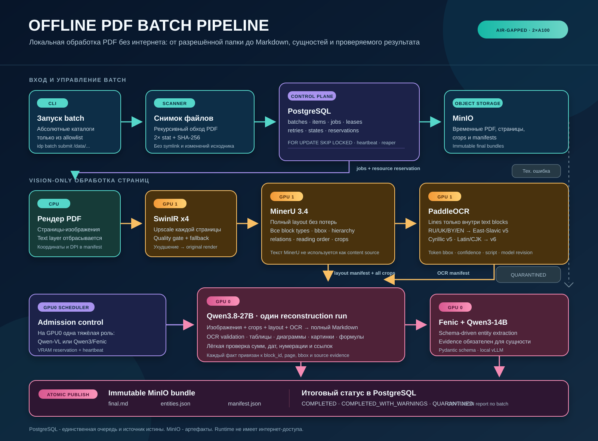

# Offline PDF Batch Pipeline

Локальный полностью изолированный pipeline для пакетной обработки PDF. Система рекурсивно обходит разрешённые каталоги, превращает документы в заземлённый Markdown, извлекает сущности и публикует воспроизводимый результат в MinIO.

PDF text layer намеренно не используется: документ обрабатывается только как изображение страниц.

## Логика работы



## Компоненты

| Компонент | Назначение | Ресурс |
|---|---|---|
| PostgreSQL | Источник истины, очередь работ, leases, retries, статусы и reservations | CPU / disk |
| MinIO | Временные артефакты и immutable result bundles | Local storage |
| Render | Детерминированный PDF-to-image; text layer игнорируется | CPU |
| SwinIR x4 | Upscale каждой страницы с автоматическим fallback | GPU1 |
| MinerU 3.4 | Полный layout всех блоков и reading order | GPU1 |
| PaddleOCR | Построчный OCR только внутри текстовых блоков MinerU | GPU1 |
| Qwen2.5-VL-32B | OCR validation, таблицы, изображения, диаграммы, формулы и сборка Markdown | GPU0 |
| Fenic + Qwen3-14B | Schema-driven extraction сущностей из Markdown | GPU0 |

## Что сохраняет MinerU

Внутренний `layout_manifest` сохраняет каждый блок без потерь: текст, заголовки, списки, таблицы, изображения, диаграммы, формулы, header/footer, сноски, печати и подписи. Для каждого блока доступны `block_id`, страница, bbox, hierarchy, relations, reading order и ссылка на crop.

OCR обрабатывает только текстовые блоки. Все остальные блоки передаются в Qwen-VL вместе с изображением и metadata: модель расшифровывает таблицы, интерпретирует диаграммы, графики и формулы, затем включает значимую информацию в единый Markdown.

## Запуск

В репозитории есть два deployment profile:

- `infra/compose/local.yml` поднимает PostgreSQL, MinIO, Alembic migration, controller и idle worker для локальной проверки control plane.
- `infra/compose/target.yml` требует immutable image digests и секреты, отключает внешний network egress через internal network и запускает migration до controller/worker.

PostgreSQL control plane реализует `FOR UPDATE SKIP LOCKED`, leases/heartbeat recovery, retries/quarantine, resource pools, MinIO artifact contract и atomic final-output pointer. Batch API принимает только абсолютные каталоги внутри `IDP_ALLOWED_ROOTS`, не следует symbolic links, сохраняет все dispositions и перед постановкой работы копирует stable PDF из проверенного file descriptor в temporary artifact storage.

Команда submit создаёт immutable snapshot и сразу возвращает batch ID:

```bash
idp batch submit /data/incoming/contracts /data/incoming/reports
```

Проверка состояния и полный отчёт:

```bash
idp batch status <batch-id>
idp batch report <batch-id> --format json
```

Controller продолжает обработку после закрытия терминала. После падения worker/controller задания возвращаются в очередь по истечении lease.

Отчёт всегда содержит все пути: queued, reused, skipped, quarantined и cancelled. Повторить можно только quarantined item, используя уже скопированный immutable source object, а не изменившийся исходный файл:

```bash
idp batch report <batch-id> --format csv
idp batch cancel <batch-id>
idp batch retry <item-id>
```

Повторное содержимое PDF переиспользует published final bundle только при совпадении SHA-256 и immutable `pipeline_profile_hash`; промежуточные, cancelled и незавершённые результаты не переиспользуются.

## Результаты

Для каждого технически обработанного PDF публикуется immutable bundle в MinIO:

```text
final.md
entities.json
manifest.json
```

`manifest.json` содержит hashes, artifact lineage, profile/model/prompt/schema versions, OCR coverage, VLM findings, fallback decisions, попытки обработки и `quality=pass|warning|failed`.

`quality=failed` не скрывает технически готовый результат: он публикуется со статусом `COMPLETED_WITH_WARNINGS`. Файлы, которые невозможно обработать технически, получают `QUARANTINED` и не блокируют оставшийся batch.

## Air-Gapped Развёртывание

Runtime не имеет доступа к интернету и не выполняет model/package downloads. Connected build host готовит immutable release bundle с pinned OCI images, Python wheelhouse, системными пакетами, моделями, tokenizers, OCR dictionaries, checksums, SBOM и import scripts.

Release bundle содержит подписанный Ed25519 `manifest.json`: для каждого asset в нём зафиксированы путь, тип, размер и SHA-256. Private signing key остаётся только на connected build host; target хранит только public verification key. Target не может выпустить доверенный release самостоятельно.

```bash
# Connected build host: явный JSON build spec + private key.
idp release build release-spec.json ./out/release-2026.07.13 --private-key ./release-private.pem

# Target: проверить транспортируемый bundle, импортировать, активировать.
idp release verify /media/release-2026.07.13 --public-key /etc/idp/release-public.pem
idp release import /media/release-2026.07.13
idp release activate release-2026.07.13
idp profile validate
```

Импорт сначала проверяет signature и SHA-256 всех assets, копирует bundle в staging, повторно проверяет его и только затем атомарно публикует immutable release directory. OCI archives загружаются только из проверенных локальных файлов. Rollback переключает активный symlink на уже импортированный проверенный release и не требует интернет-доступа:

```bash
idp release rollback release-2026.07.12
```

`profile validate` проверяет active release, offline flags, PostgreSQL и MinIO до запуска controller/worker. Systemd units в `infra/systemd/` делают эту проверку обязательной startup dependency.

## Тестирование

- Local CI запускает unit, schema, queue, storage и mocked integration tests без GPU и model weights.
- Target server запускает resumable real-model smoke и canary/soak suites только перед promotion model/runtime/profile.
- Пока нет размеченного ground truth, quality checks подтверждают схемы, lineage, evidence, recovery и resource limits, но не заявляют accuracy metrics.
