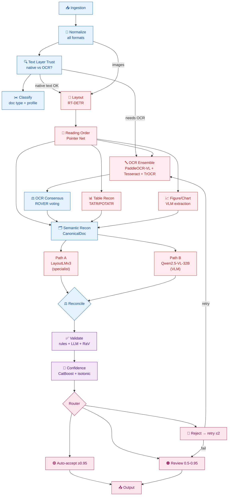
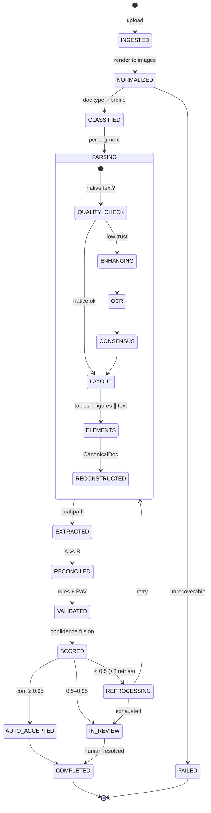
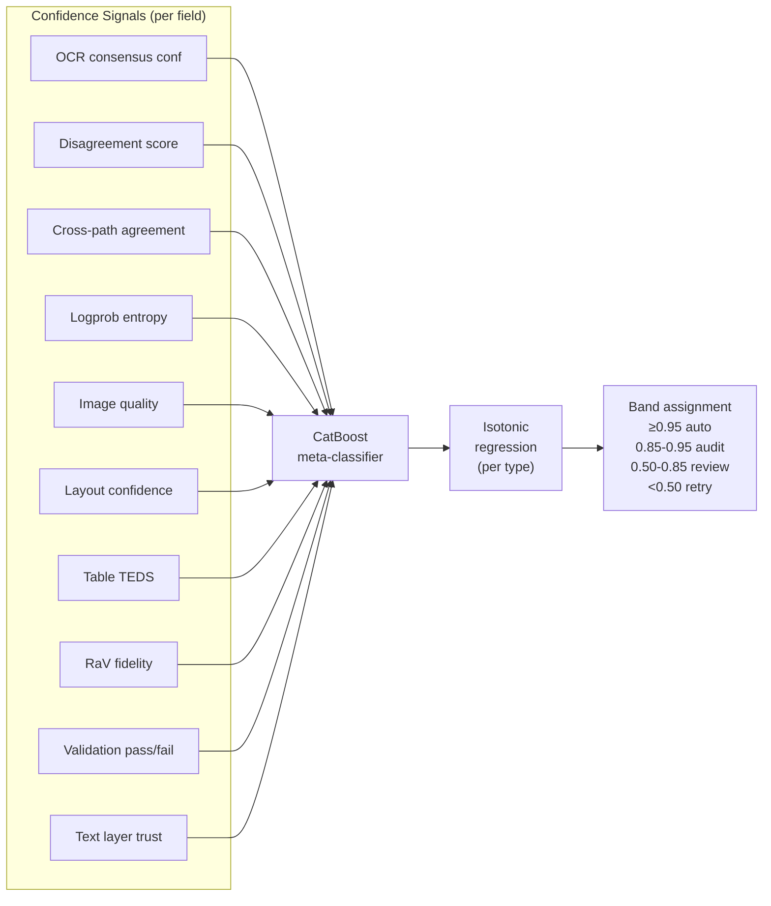
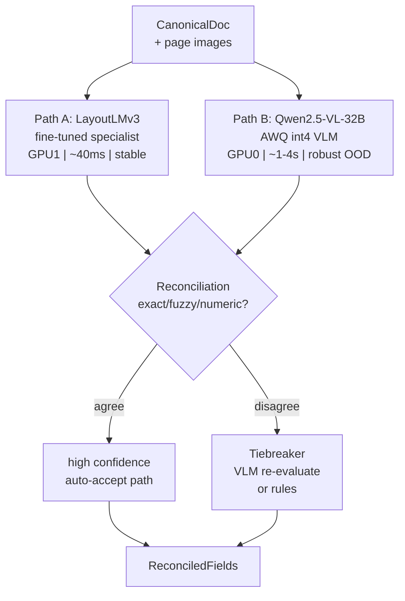

# IDP System — Executive Summary

> Air-gapped · 2×A100 40GB · Python · 18 microservices · DAG pipeline · Dual-path extraction

---

## 1. Architecture at a Glance



---

## 2. Tool Stack

| Layer | Tool | Why |
|-------|------|-----|
| **Queue** | Kafka (on-prem) | Event-driven DAG, exactly-once, replay |
| **Storage** | MinIO (S3-compatible) | Immutable blobs, page images, artifacts |
| **Database** | PostgreSQL | Document state, stage results, audit |
| **Cache** | Redis | Idempotency, dedup, distributed locks |
| **ML Registry** | MLflow (offline) | Model versioning, calibration curves |
| **Serving (VLM)** | vLLM | Qwen2.5-VL-32B AWQ on GPU0 |
| **Serving (classical)** | Triton / direct | RT-DETR, TATR, LayoutLMv3 on GPU1 |
| **gRPC** | grpcio + proto3 | Inter-service contracts |
| **Async** | FastStream + aiokafka | Kafka consumer/producer |
| **Web** | FastAPI | REST APIs, HITL portal, Swagger |
| **Logs** | Loki | Structured JSON logs |
| **Metrics** | Prometheus + Grafana | RED + domain metrics |
| **Traces** | OpenTelemetry + Tempo | One trace = one document journey |
| **Orchestration** | Kubernetes + Kustomize | Production deployment |
| **CI/CD** | GitHub Actions | Lint → Test → Build → Deploy |

---

## 3. GPU Budget (2×A100 40GB)

```
┌─────────────────────────────────────────────────────────────────┐
│ GPU0 (A100 40GB)              │ GPU1 (A100 40GB)               │
│                               │                                │
│  Qwen2.5-VL-32B AWQ          │  RT-DETR/PP-DocLayoutV2  ~2GB  │
│  (vLLM, TP=1)                │  Pointer Network          ~1GB  │
│  ~20GB weights                │  PaddleOCR-VL-0.9B        ~3GB  │
│  ~18GB KV-cache               │  TATR/POTATR              <1GB  │
│                               │  LayoutLMv3 (Path A)      ~2GB  │
│  USES:                        │  Real-ESRGAN (enhance)          │
│  - Path B extraction          │                                │
│  - Hunter-Mapper confidence   │  USES:                         │
│  - LLM validation             │  - Layout detection             │
│  - RaV comparison             │  - All OCR engines              │
│                               │  - Table/figure recognition     │
│  ─────────────────            │  - Path A extraction            │
│  ~38GB used / 40GB            │  ─────────────────              │
│                               │  ~8GB used / 40GB              │
│                               │  (large headroom)              │
└─────────────────────────────────────────────────────────────────┘
```

---

## 4. Document Lifecycle (State Machine)



---

## 5. Confidence Flow



---

## 6. Dual-Path Extraction Logic



---

## 7. Key Models

| Model | Params | GPU | Role | Source |
|-------|--------|-----|------|--------|
| Qwen2.5-VL-32B AWQ | 32B (int4) | GPU0 | Path B extraction, confidence, validation | HuggingFace |
| PaddleOCR-VL-0.9B | 0.9B | GPU1 | Primary OCR, chart recognition | Baidu |
| RT-DETR / PP-DocLayoutV2 | ~0.1B | GPU1 | Layout detection | Baidu |
| TATR / POTATR | 29M | GPU1 | Table structure recognition | Microsoft |
| LayoutLMv3 | ~0.2B | GPU1 | Path A specialist, classification | Microsoft |
| TrOCR | ~0.1B | GPU1 | Handwriting OCR | Microsoft |
| Tesseract 5 | — | CPU | Diverse OCR engine (consensus) | Open source |
| Real-ESRGAN | ~16M | GPU1 | Super-resolution for low-DPI | Open source |
| CatBoost | — | CPU | Confidence meta-classifier | Yandex |
| Pointer Network | ~50M | GPU1 | Reading order prediction | Baidu |

---

## 8. Data Flow (artifacts)

```
Raw File
  → page-images (PNG) + native_text.json + render_manifest
    → ClassificationResult (doc_type, profile, segments)
      → TrustMap (per-region: use_native | ocr)
        → enhanced crops + enhancement_manifest
          → EngineHypotheses (per-engine text + char conf)
            → ConsensusText (tokens, disagreement)
              → LayoutGraph (regions, reading_order, hierarchy)
                → TableStruct (HTML/OTSL/grid) + FigureResult (data/embedding)
                  → CanonicalDoc (blocks, markdown, cross-page links)
                    → ExtractionCandidates (path_a, path_b)
                      → ReconciledFields (agreement, chosen)
                        → ValidationReport (format, cross-field, RaV, external)
                          → CalibratedConfidence (per-field band, doc_confidence)
                            → FinalOutput (values + confidence + citations)
```

---

## 9. Service Summary (18 services)

| # | Service | GPU | Complexity |
|---|---------|-----|------------|
| S1 | Ingestion | — | Low |
| S2 | Normalize/Render | CPU | Medium |
| S3 | Classification | GPU1 | High |
| S4 | Text Layer Quality | CPU | Medium |
| S5 | Image Enhancement | GPU1 | Medium |
| S6 | OCR Ensemble | GPU1 | High |
| S7 | OCR Consensus | CPU | Medium |
| S8 | Layout Reconstruction | GPU1 | Very High |
| S9 | Table Reconstruction | GPU1 | Very High |
| S10 | Figure Processing | GPU1 | High |
| S11 | Semantic Reconstruction | CPU | High |
| S12 | Entity Extraction (dual) | GPU0+GPU1 | Very High |
| S13 | Reconciliation | CPU | Low |
| S14 | Validation Engine | CPU | High |
| S15 | Confidence Fusion | CPU | High |
| S16 | Routing & HITL | — | Medium |
| S17 | Feedback/Training | offline | Medium |
| S18 | Orchestrator | — | High |

---

## 10. Implementation Phases

```
Phase 0  ██████████  Foundation (infra, common libs, CI/CD, synthetic data)
Phase 1  ██████████  Skeleton Pipeline (ingestion + normalization, e2e trace)
Phase 2  ██████████  Classification + Text Quality (routing decisions)
Phase 3  ██████████  OCR Pipeline (ensemble + consensus)
Phase 4  ██████████  Layout + Tables + Figures + Semantic
Phase 5  ██████████  Entity Extraction (dual-path: specialist + VLM)
Phase 6  ██████████  Validation + Confidence Fusion
Phase 7  ██████████  Routing + HITL + Feedback
Phase 8  ██████████  Orchestrator (full DAG)
Phase 9  ██████████  Production Hardening (security, load test, air-gap)
Phase 10 ██████████  Continuous Learning (retraining, canary, active learning)

MVP:          Phases 0–5     (ingestion → extraction → CanonicalDoc)
Production:   Phases 0–8     (+ validation, confidence, HITL, orchestrator)
Enterprise:   Phases 0–10    (+ hardening, continuous learning)
```

---

## 11. Deployment Topology

```
                    ┌─────────────────────────────────────────┐
                    │           Kubernetes Cluster             │
                    │                                         │
                    │  ┌──────────┐  ┌──────────────────────┐│
                    │  │ Kafka    │  │ PostgreSQL           ││
                    │  │ (3 node) │  │ (primary + replica)  ││
                    │  └──────────┘  └──────────────────────┘│
                    │  ┌──────────┐  ┌──────────────────────┐│
                    │  │ MinIO    │  │ Redis                ││
                    │  │ (4 node) │  │ (sentinel)           ││
                    │  └──────────┘  └──────────────────────┘│
                    │                                         │
                    │  ┌─────────────────────────────────┐   │
                    │  │ GPU Node (2×A100 40GB)          │   │
                    │  │                                 │   │
                    │  │ GPU0: Qwen2.5-VL-32B (vLLM)    │   │
                    │  │  → S12-PathB, S14, S15-Hunter   │   │
                    │  │                                 │   │
                    │  │ GPU1: parsing stack              │   │
                    │  │  → S3, S5, S6, S8, S9, S10, S12A│   │
                    │  └─────────────────────────────────┘   │
                    │                                         │
                    │  ┌─────────────────────────────────┐   │
                    │  │ CPU Nodes (8-16 vCPU)           │   │
                    │  │ S1, S2, S4, S7, S11, S13, S15, │   │
                    │  │ S16, S17, S18                    │   │
                    │  └─────────────────────────────────┘   │
                    │                                         │
                    │  ┌─────────────────────────────────┐   │
                    │  │ Observability                    │   │
                    │  │ Prometheus + Grafana + Loki      │   │
                    │  │ + Tempo                          │   │
                    │  └─────────────────────────────────┘   │
                    │                                         │
                    │  ┌─────────────────────────────────┐   │
                    │  │ MLflow (offline mode)            │   │
                    │  └─────────────────────────────────┘   │
                    └─────────────────────────────────────────┘

                    NO INTERNET (air-gapped)
```

---

## 12. Critical Metrics

| Metric | Target | Measurement |
|--------|--------|-------------|
| OCR CER (consensus) | < best single engine CER | Synthetic corpus |
| Layout mAP | ≥ 0.85 | DocLayNet benchmark |
| Table TEDS | ≥ 0.85 | PubTables-v2 benchmark |
| Per-field extraction F1 | ≥ 0.85 each path | Synthetic + HITL labeled |
| Confidence ECE | < 0.03 | Spot-check weekly |
| Auto-accept rate | ≥ 60% | Production |
| Pipeline success rate | ≥ 95% | End-to-end |
| End-to-end latency p95 | < 5 min (10-page PDF) | Load test |
| Throughput | ≥ 1000 docs/hour | Load test on 2×A100 |
