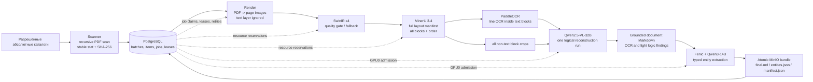
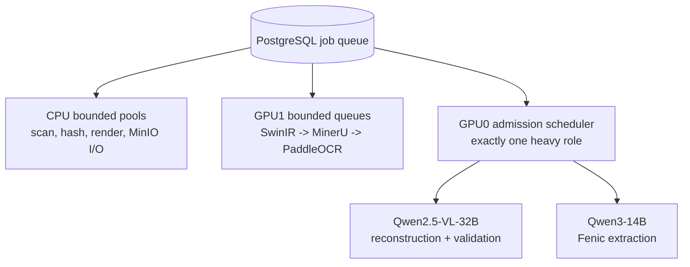
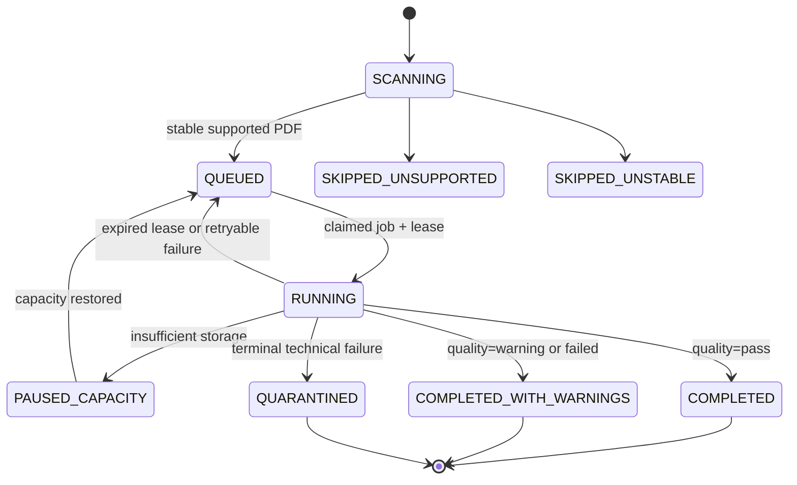

# Offline PDF Batch Pipeline

Локальный, air-gapped пайплайн для рекурсивной обработки PDF. Система принимает абсолютные каталоги, создаёт неизменяемый batch-снимок файлов и публикует Markdown с извлечёнными сущностями. PDF text layer всегда отбрасывается.

## Поток данных

## Компоненты

| Компонент | Роль | Вход | Выход |
|---|---|---|---|
| Controller | Управляет batch lifecycle и dependency graph | `batch submit` | jobs, terminal reports |
| PostgreSQL | Единственная очередь и источник истины | batch/item/job state | leases, retries, artifact pointers |
| MinIO | Versioned artifacts и final output | temporary artifacts | immutable final bundles |
| Render | Рендерит PDF только в изображения | PDF bytes | page images, coordinate manifest |
| SwinIR x4 | Улучшает страницу без GAN | page image | chosen image, fallback decision |
| MinerU 3.4 | Полный layout документа | chosen page image | all block types, bbox, hierarchy, reading order |
| PaddleOCR | Распознаёт строки в text-bearing blocks | MinerU text-block crops | OCR tokens, confidence, provenance |
| Qwen2.5-VL-32B | Собирает и проверяет документ | layout, images/crops, OCR | grounded Markdown, findings |
| Fenic + Qwen3-14B | Извлекает сущности по Pydantic schema | Markdown with provenance | typed entities with evidence |

## Блоки MinerU

`layout_manifest` сохраняет каждый блок MinerU без потерь: text, title, list, table, image, chart, formula, header, footer, footnote, stamp, signature и будущие поддерживаемые типы. Для каждого блока сохраняются `block_id`, page, bbox, hierarchy, relations, reading order и crop reference.

OCR применяется только к text-bearing blocks. Остальные блоки не отбрасываются: Qwen-VL получает их изображения и metadata, расшифровывает таблицы, интерпретирует диаграммы/графики/формулы и включает значимую информацию в итоговый Markdown.

## Ресурсы

- GPU1 запускает SwinIR, MinerU и PaddleOCR в отдельных bounded queues.
- GPU0 запускает либо Qwen-VL, либо Qwen3. Одновременная загрузка двух тяжёлых ролей запрещена.
- PostgreSQL reservations, heartbeats и leases предотвращают oversubscription и возвращают работу после падения worker.
- Ограничены размер PDF, число страниц, pixels/page, crop area, artifact size, queue depth, timeout, retries, CPU/RAM/VRAM и свободное место MinIO.

## Качество без PDF text layer

Качество не является отдельным сервисом и не зависит от text layer. `manifest.json` фиксирует:

- решение quality gate для upscale;
- OCR coverage, confidence, language/script и model revision;
- Qwen-VL OCR corrections только с visual evidence;
- VLM findings: OCR disagreement, нечитаемые blocks, пропуски blocks, очевидные несогласованности сумм, дат, нумерации и ссылок;
- evidence coverage сущностей и итоговый `quality=pass|warning|failed`.

`quality=failed` технически публикуется как `COMPLETED_WITH_WARNINGS`; это не подтверждение правильности результата. Технически невозможные файлы получают `QUARANTINED` и не блокируют batch.

## Состояния

## Вход и выход

| Категория | Контракт |
|---|---|
| Submit | `idp batch submit /allowed/root-a /allowed/root-b` |
| Поддерживаемый файл | PDF, стабильный в момент scan, внутри allowlist root |
| Final Markdown | `final.md`, блоки с `block_id`, page, bbox и evidence |
| Entities | `entities.json`: type, value, normalized_value, page, block_id, bbox, evidence, confidence |
| Manifest | `manifest.json`: hashes, lineage, profile/model/prompt/schema versions, quality, findings, retries |
| Report | `idp batch report BATCH_ID --format json|csv` |

## Offline и тестирование

- Целевая машина не имеет доступа к интернету. Runtime использует только локальные services и запрещает downloads/telemetry/egress.
- Один Docker Compose stack монтирует исходный код, локальные модели, OCR/MinerU-инструменты, входящие PDF и persistent data с хоста; rebuild приложения не нужен.
- Windows build script собирает переносимый application image, а `operator` запускает healthcheck, batch-команды и тесты без установки Python на хосте.
- Local CI запускает unit/schema/queue/storage tests без GPU и весов.
- Target server запускает resumable model smoke и canary/soak tests только для profile/runtime promotion.
- Пока нет ground truth, система не заявляет accuracy metrics; audit sampling формирует будущий размеченный corpus.
