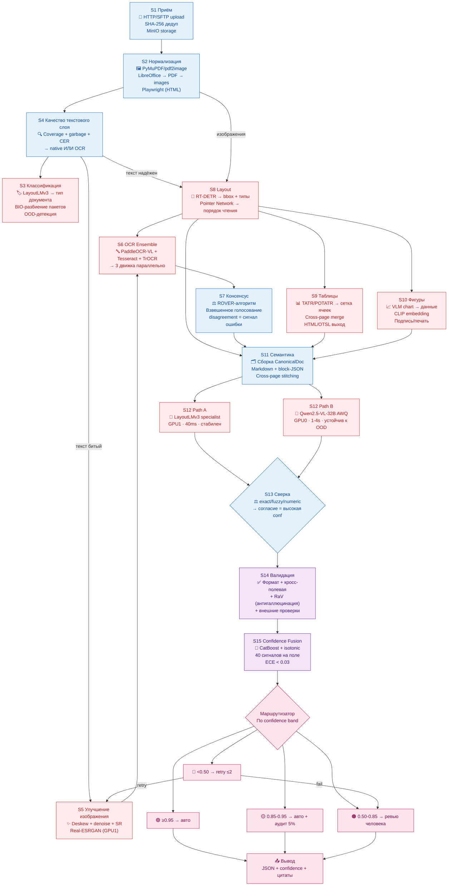
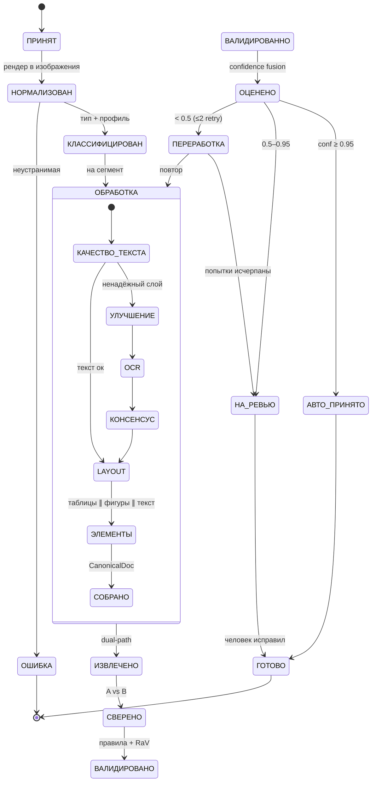
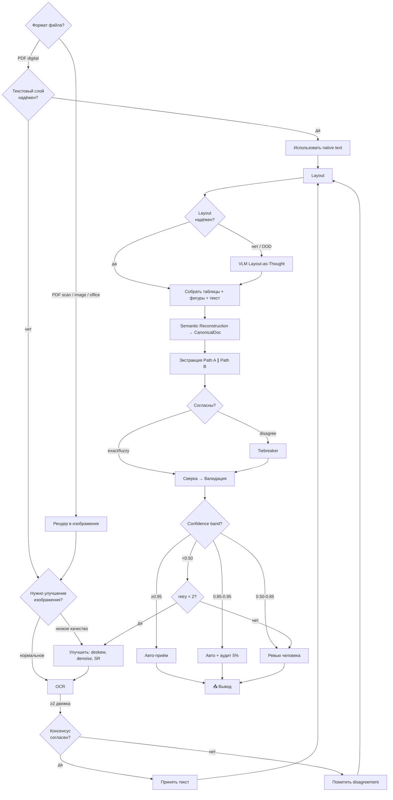
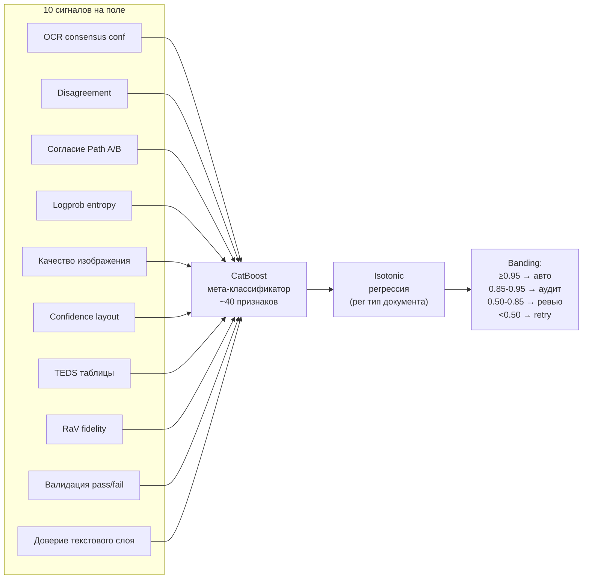
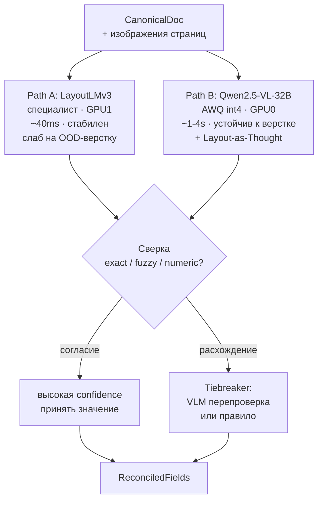

# IDP — Конспект системы

> Обработка документов · Air-gapped · 2×A100 40GB · 18 микросервисов · Python · gRPC · Kafka

---

## 1. Архитектура системы



---

## 2. Инструменты и технологии

| Слой | Инструмент | Зачем |
|------|-----------|-------|
| **Очередь** | Kafka (on-prem) | Событийная оркестрация DAG, exactly-once, реплей |
| **Хранилище файлов** | MinIO (S3-compatible) | Неизменяемые бинарники: оригиналы, страницы, кропы, артефакты |
| **База данных** | PostgreSQL | Состояние документов, результаты этапов, аудит, калибровка |
| **Кэш** | Redis | Идемпотентность (TTL 7д), дедуп, распределённые замки, circuit breaker |
| **ML-реестр** | MLflow (offline) | Версии моделей, кривые калибровки, метрики экспериментов |
| **VLM serving** | vLLM | Qwen2.5-VL-32B AWQ на GPU0 |
| **Классический inference** | Triton / прямой import | RT-DETR, TATR, LayoutLMv3 на GPU1 |
| **Межсервисный RPC** | gRPC + proto3 | Контракты с версионированием |
| **Асинхронная связь** | FastStream + aiokafka | Kafka consumer/producer |
| **HTTP API** | FastAPI | REST-эндпоинты, HITL-портал, Swagger |
| **Логи** | Loki | Структурированные JSON-логи (без PII) |
| **Метрики** | Prometheus + Grafana | RED-метрики + доменные дашборды |
| **Трейсы** | OpenTelemetry + Tempo | Одна trace = путь одного документа |
| **Оркестрация** | Kubernetes + Kustomize | Продакшен-развёртывание |
| **CI/CD** | GitHub Actions | Lint → Test → Build → Deploy |

---

## 3. Бюджет GPU (2×A100 40GB)

```
┌──────────────────────────────────────┬──────────────────────────────────────┐
│ GPU0 (A100 40GB)                     │ GPU1 (A100 40GB)                     │
│                                      │                                      │
│ Qwen2.5-VL-32B AWQ int4             │ RT-DETR/PP-DocLayoutV2       ~2 GB   │
│ (vLLM, TP=1)                         │ Pointer Network              ~1 GB   │
│ ~20 GB веса + ~18 GB KV-cache        │ PaddleOCR-VL-0.9B            ~3 GB   │
│                                      │ TATR/POTATR                  <1 GB   │
│ ИСПОЛЬЗУЕТСЯ ДЛЯ:                    │ LayoutLMv3 (Path A)          ~2 GB   │
│ • Path B (VLM-экстракция)            │ Real-ESRGAN (улучшение)      ~1 GB   │
│ • Hunter-Mapper (confidence)         │                                      │
│ • LLM-валидация (cross-field)        │ ИСПОЛЬЗУЕТСЯ ДЛЯ:                    │
│ • RaV-сравнение                      │ • Детекция layout                   │
│                                      │ • Все OCR-движки                    │
│ Занято: ~38/40 GB                    │ • Таблицы, фигуры                   │
│                                      │ • Path A (специалист)               │
│                                      │                                      │
│                                      │ Занято: ~8/40 GB (большой запас)    │
└──────────────────────────────────────┴──────────────────────────────────────┘
```

---

## 4. Жизненный цикл документа



---

## 5. Входы и выходи каждого сервиса

| Сервис | Вход | Выход | Модели | GPU |
|--------|------|-------|--------|-----|
| **S1 Приём** | HTTP upload (bytes) | doc_id, объект в MinIO, событие Kafka | — | — |
| **S2 Нормализация** | Оригинал файла | page-images PNG + native_text.json + render_manifest | PyMuPDF, LibreOffice, Playwright | CPU |
| **S3 Классификация** | Page-images + native_text | page_labels, doc_type, segments, processing_profile | LayoutLMv3 classifier, Donut | GPU1 |
| **S4 Качество текста** | native_text + page-images | TrustMap: per-region trust → use_native/ocr | Tesseract (cross-check), fastText LID, логистический агрегатор | CPU |
| **S5 Улучшение** | low-trust регионы (bbox) | enhanced crops + enhancement_manifest | Real-ESRGAN, Sauvola binarization, OpenCV | GPU1 |
| **S6 OCR Ensemble** | enhanced crops + хинт языка | EngineHypotheses: per-engine text + char conf | PaddleOCR-VL-0.9B, Tesseract 5, TrOCR | GPU1+CPU |
| **S7 Консенсус** | EngineHypotheses | ConsensusText: tokens, agreement, disagreement | ROVER + правила + ByT5 (опц.) | CPU |
| **S8 Layout** | page-images + текст | LayoutGraph: regions + bbox + reading_order + hierarchy | RT-DETR, Pointer Network | GPU1 |
| **S9 Таблицы** | table-регионы + текст | TableStruct: grid + cells + HTML/OTSL + column_semantics | TATR/POTATR, cross-page classifier | GPU1 |
| **S10 Фигуры** | figure/chart/signatureрегионы | FigureResult: chart_data + caption + embedding | Qwen2.5-VL, CLIP, seal-recognition | GPU0+GPU1 |
| **S11 Семантика** | LayoutGraph + текст + таблицы + фигуры | CanonicalDoc: blocks + markdown + cross-page links | LLM (спорный stitching, опц.) | CPU/GPU0 |
| **S12 Экстракция Path A** | CanonicalDoc + schema | ExtractionCandidates (path_a) | LayoutLMv3 fine-tuned | GPU1 |
| **S12 Экстракция Path B** | CanonicalDoc + images + schema | ExtractionCandidates (path_b) + logprobs | Qwen2.5-VL-32B AWQ | GPU0 |
| **S13 Сверка** | path_a + path_b поля | ReconciledFields: value + agreement | Stickler-компаратор + embedding | CPU |
| **S14 Валидация** | reconciled fields + doc + images | ValidationReport: checks + fidelity | Правила + LLM cross-field + RaV | CPU/GPU0 |
| **S15 Confidence** | все сигналы | CalibratedConfidence: per-field confidence + band | CatBoost + isotonic + Hunter-Mapper | CPU+GPU0 |
| **S16 Маршрутизация** | confidence + profile | output/review/reject | — | — |
| **S17 Обратная связь** | HITL-исправления | обновлённые модели + калибровки | Дообучение LayoutLMv3, CatBoost | offline |
| **S18 Оркестратор** | события всех этапов | DAG-переходы, timeouts, state machine | — | — |

---

## 6. Логика обработки (Decision Tree)



---

## 7. Конфиденциальность (Confidence Flow)



**Целевые метрики confidence:**
| Метрика | Цель |
|---------|------|
| ECE (Expected Calibration Error) | < 0.03 |
| Brier score | < 0.10 |
| AUROC (agreement → correct) | ≥ 0.80 |
| Auto-accept rate | ≥ 60% |
| Review rate | ≤ 30% |
| Reject rate | ≤ 10% |

---

## 8. Dual-Path Extraction



**Почему две модели:** LayoutLMv3 стабильна на известных типах документов, но ломается на нестандартной вёрстке. Qwen2.5-VL устойчива к вариациям вёрстки, но менее детерминирована. Их расхождение — сигнал ошибки (EU-банк: 99.2% точность при 4.1% ревью).

---

## 9. Ключевые модели

| Модель | Параметры | GPU | Роль | Источник |
|--------|-----------|-----|------|----------|
| Qwen2.5-VL-32B AWQ | 32B (int4) | GPU0 | Path B, confidence, валидация | HuggingFace |
| PaddleOCR-VL-0.9B | 0.9B | GPU1 | Основной OCR, chart recognition | Baidu |
| RT-DETR / PP-DocLayoutV2 | ~0.1B | GPU1 | Детекция layout | Baidu |
| TATR / POTATR | 29M | GPU1 | Структура таблиц | Microsoft |
| LayoutLMv3 | ~0.2B | GPU1 | Path A, классификация | Microsoft |
| TrOCR | ~0.1B | GPU1 | OCR рукописей | Microsoft |
| Tesseract 5 | — | CPU | Разнообразие в ensemble | Open source |
| Real-ESRGAN | ~16M | GPU1 | Супер-решолюция | Open source |
| CatBoost | — | CPU | Мета-классификатор confidence | Yandex |
| Pointer Network | ~50M | GPU1 | Порядок чтения | Baidu |

---

## 10. Поток данных (артефакты)

```
Сырой файл
  → page-images (PNG) + native_text.json + render_manifest
    → ClassificationResult (doc_type, profile, segments)
      → TrustMap (per-region: use_native | ocr)
        → enhanced crops + enhancement_manifest
          → EngineHypotheses (per-engine text + char conf)
            → ConsensusText (tokens, disagreement)
              → LayoutGraph (regions, reading_order, hierarchy)
                → TableStruct (HTML/OTSL/grid)
                → FigureResult (chart_data, embedding)
                  → CanonicalDoc (blocks, markdown, cross-page links)
                    → ExtractionCandidates (path_a, path_b)
                      → ReconciledFields (agreement, chosen)
                        → ValidationReport (format, cross-field, RaV, external)
                          → CalibratedConfidence (per-field band, doc_confidence)
                            → FinalOutput (значения + confidence + цитаты)
```

---

## 11. Консоль ошибок и retry

| Класс ошибки | Пример | Действие |
|-------------|--------|----------|
| `TRANSIENT` | GPU OOM, timeout, Kafka backpressure | Retry: exp backoff 2s, max 60s, 3 попытки |
| `DATA` | Битый файл, unsupported codec | Dead-letter → DLQ, без retry |
| `MODEL` | Невалидный JSON выхода модели | Fallback модель → DLQ |
| `POISON` | Повторяющийся crash | Quarantine topic + alert |

**Circuit breaker**: после N последовательных падений → fallback → half-open probe.

**Self-correct loop**: reject (<0.50) → реформулировать промпт / сменить OCR-движок / сменить VLM → max 2 retry → HITL.

---

## 12. Метрики системы

| Метрика | Цель | Измерение |
|---------|------|-----------|
| OCR CER (консенсус) | < лучший одиночный движок | Synthetic corpus |
| Layout mAP | ≥ 0.85 | DocLayNet |
| Table TEDS | ≥ 0.85 | PubTables-v2 |
| Per-field extraction F1 | ≥ 0.85 (каждый путь) | Synthetic + HITL |
| Confidence ECE | < 0.03 | Spot-check еженедельно |
| Auto-accept rate | ≥ 60% | Продакшен |
| Pipeline success rate | ≥ 95% | End-to-end |
| End-to-end latency p95 | < 5 мин (10 стр) | Load test |
| Throughput | ≥ 1000 документов/час | 2×A100 |

---

## 13. Фазы реализации

```
Phase 0  ████████  Инфраструктура (Kafka, PG, MinIO, Redis, MLflow, common libs, CI/CD, synthetic data)
Phase 1  ████████  Скелет пайплайна (приём + нормализация, e2e trace)
Phase 2  ████████  Классификация + качество текста (роутинг по типу)
Phase 3  ████████  OCR Ensemble (3 движка + консенсус)
Phase 4  ████████  Layout + Таблицы + Фигуры + Семантика
Phase 5  ████████  Экстракция (dual-path: LayoutLMv3 + Qwen2.5-VL)
Phase 6  ████████  Валидация + Confidence Fusion
Phase 7  ████████  Маршрутизация + HITL + обратная связь
Phase 8  ████████  Оркестратор (полный DAG)
Phase 9  ████████  Production (безопасность, нагрузка, air-gap)
Phase 10 ████████  Непрерывное обучение (retrain, canary, active learning)

MVP:          Phase 0–5  (приём → экстракция → CanonicalDoc)
Production:   Phase 0–8  (+ валидация, confidence, HITL, оркестратор)
Enterprise:   Phase 0–10 (+ харденинг, непрерывное обучение)
```

---

## 14. Структура репозитория

```
idp/
├── contracts/protos/          # gRPC-контракты всех 18 сервисов
├── libs/idp-common/           # Общая библиотека (envelope, kafka, storage, retry, observability)
├── services/
│   ├── s1-ingestion/          # Каждый сервис — отдельный контейнер
│   ├── s2-normalize/
│   ├── s3-classify/
│   ├── s4-text-quality/
│   ├── s5-enhance/
│   ├── s6-ocr-ensemble/
│   ├── s7-ocr-consensus/
│   ├── s8-layout/
│   ├── s9-table/
│   ├── s10-figure/
│   ├── s11-semantic/
│   ├── s12-extraction/
│   ├── s13-reconcile/
│   ├── s14-validation/
│   ├── s15-confidence/
│   ├── s16-routing/
│   ├── s17-feedback/
│   └── s18-orchestrator/
├── infra/
│   ├── docker-compose.yml     # Локальная разработка
│   ├── kubernetes/            # Kustomize base + overlays (dev/prod)
│   └── airgap/                # Offline provisioning
├── configs/
│   ├── profiles/              # YAML-схемы типов документов
│   ├── schemas/               # JSON Schema полей экстракции
│   ├── rules/                 # Правила валидации
│   └── calibration/           # Кривые isotonic regression
├── data/
│   ├── synthetic/             # Генератор + набор
│   ├── benchmarks/            # DocLayNet, PubTables, DocVQA
│   └── labeled/               # Размеченные данные
├── tests/
│   ├── unit/                  # 500+ тестов, каждый push
│   ├── integration/           # 50 тестов, каждый PR
│   ├── contract/              # gRPC контрактные тесты
│   ├── e2e/                   # 10 тестов, nightly
│   └── performance/           # Locust/k6 нагрузочные
├── docs/
│   ├── SUMMARY.md             # Этот конспект
│   ├── architecture.md        # Архитектура + спецификация
│   └── implementation-plan.md # План реализации
├── .github/workflows/         # CI/CD
├── Makefile
└── README.md
```

---

## 15. Docker Compose (локальная разработка)

```yaml
services:
  # ── Инфраструктура ──
  kafka:        confluentinc/cp-kafka:7.6.0        (port 9092)
  postgres:     postgres:16-alpine                  (port 5432)
  minio:        minio/minio                         (port 9000/9001)
  redis:        redis:7-alpine                      (port 6379)
  mlflow:       ghcr.io/mlflow/mlflow:v2.16.0       (port 5000)
  
  # ── Мониторинг ──
  loki:         grafana/loki:3.1.0                  (port 3100)
  prometheus:   prom/prometheus:v2.54.0             (port 9090)
  grafana:      grafana/grafana:11.2.0              (port 3000)
  tempo:        grafana/tempo:2.6.0                 (port 3200)
  
  # ── CPU-сервисы ──
  s1-ingestion:     build: ./services/s1-ingestion
  s2-normalize:     build: ./services/s2-normalize
  s4-text-quality:  build: ./services/s4-text-quality
  s7-ocr-consensus: build: ./services/s7-ocr-consensus
  s11-semantic:     build: ./services/s11-semantic
  s13-reconcile:    build: ./services/s13-reconcile
  s14-validation:   build: ./services/s14-validation
  s15-confidence:   build: ./services/s15-confidence
  s16-routing:      build: ./services/s16-routing
  s18-orchestrator: build: ./services/s18-orchestrator
  
  # ── GPU-сервисы (CUDA_VISIBLE_DEVICES=1) ──
  s3-classify:      build + gpu (1x NVIDIA)
  s5-enhance:       build + gpu
  s6-ocr-ensemble:  build + gpu
  s8-layout:        build + gpu
  s9-table:         build + gpu
  s10-figure:       build + gpu
  
  # ── GPU-сервисы (CUDA_VISIBLE_DEVICES=0) ──
  s12-extraction:   build + gpu (Qwen2.5-VL-32B на volume)
```

---

## 16. CI/CD пайплайн

```
push → Lint(ruff) + TypeCheck(mypy) → Unit Tests → Contract Tests
  → PR: Integration Tests (testcontainers)
  → merge: Docker Build → Push to registry
  → nightly: E2E Tests (golden set) + Load Test
  → manual: Deploy to prod (ArgoCD)
```

**Quality gates:**
- Code coverage ≥ 80%
- mypy strict, ошибок = 0
- buf breaking = 0 (proto совместимость)
- Pipeline success rate ≥ 95%
- Accuracy на golden set ≥ 85%

---

## 17. Мониторинг и алерты

| Дашборд | Содержимое |
|---------|-----------|
| **Document Funnel** | Документы по состояниям; drop-off; stuck |
| **OCR** | Per-engine CER; consensus vs одиночный; disagreement |
| **Layout** | mAP; reading-order accuracy; table recall |
| **Extraction** | Per-field F1; dual-path agreement; hallucination rate |
| **Confidence** | ECE; Brier; распределение; калибровочные кривые |
| **HITL** | Очередь ревью; auto-accept rate; throughput человека |
| **Infrastructure** | GPU util/VRAM; Kafka lag; PG/Redis health |
| **SLA** | E2E latency p50/p95/p99; throughput; success rate |

**Критические алерты:**
| Алерт | Условия | Действие |
|-------|---------|----------|
| Pipeline stuck | Документ в state > 5 мин | Проверить health сервиса |
| GPU OOM | VRAM > 95% | Kill старого inference |
| Confidence drift | ECE > 0.05 | Перекалибровать |
| DLQ spike | DLQ > 1000/час | Сервис упал |
| Accuracy regression | F1 падение > 5pp | Rollback модели |

---

*Конспект: docs/SUMMARY.md · Полная архитектура: docs/architecture.md · План: docs/implementation-plan.md*
