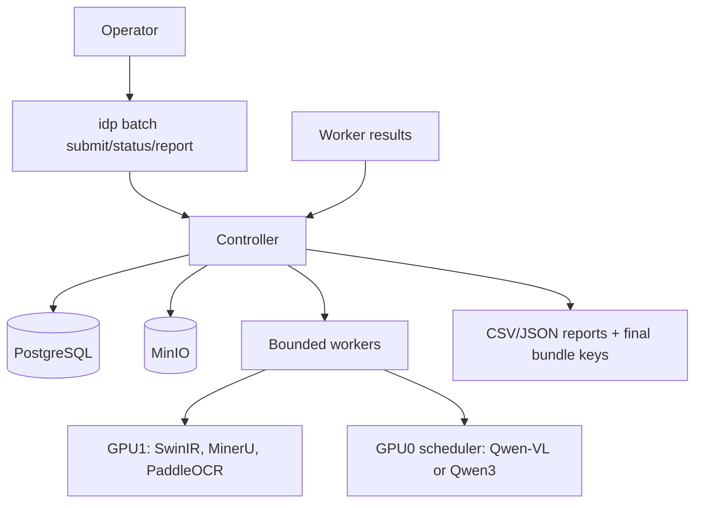
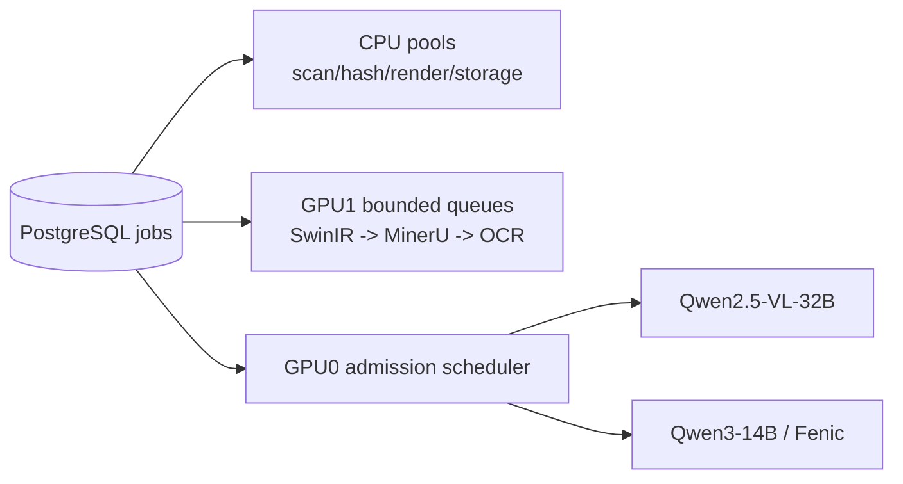

# Architecture: Offline PDF Batch Pipeline

## Scope

The system processes only PDF files submitted from explicit, allowlisted absolute directories. It is a local, disconnected deployment: no cloud APIs, package downloads, model downloads, telemetry, or internet egress at runtime.

The architecture deliberately does not contain an external message broker, document classifier, PDF native-text path, OCR ensemble, standalone text-quality service, standalone table/figure service, specialist extraction path, confidence fusion service, or HITL portal. PostgreSQL owns durable work orchestration; MinerU owns layout; a single Qwen-VL reconstruction run owns document assembly and validation.

## System Context



## Control Plane

### Submission and discovery

`idp batch submit ROOT...` verifies every root is absolute, resolves it with `realpath`, and confirms it is inside configured allowlist roots. Source directories are mounted read-only. The scanner recursively discovers PDFs, never follows symbolic links, waits for two identical file-stat observations, then calculates SHA-256.

The resulting scan snapshot is immutable. Each `batch_item` records the submitted root, observed path, file metadata, content hash, disposition and document reference. A later file change is not folded into a running batch.

### PostgreSQL queue

PostgreSQL is the source of truth and the work queue. A worker claims work with `FOR UPDATE SKIP LOCKED`; the claim has an owner, expiry time and heartbeat. A reaper requeues expired claims. Job dependencies enforce stage order. Jobs, item state changes, resource reservations and final output pointers are written in transactional boundaries.

No worker directly mutates a batch item to a terminal state. A worker emits a stage result to the controller/repository layer, which verifies idempotency and commits the state transition.

### Core records

| Record | Purpose |
|---|---|
| `pipeline_profiles` | Immutable runtime/model/prompt/schema/limit release configuration |
| `batches`, `batch_roots` | Submission and scan snapshot |
| `documents`, `batch_items` | Content identity and one path occurrence in one batch |
| `jobs`, `stage_runs` | Dependencies, claims, attempts, errors and timings |
| `resource_reservations` | GPU, CPU and storage quota admission control |
| `artifacts` | MinIO object hash, lineage and retention class |
| `entity_results` | Queryable entity summary |
| `audit_samples`, `events` | Audit selection and immutable operations log |

### Idempotency and reuse

`source_sha256` identifies the canonical document. Final output can be reused only when source hash, pipeline version, complete profile hash, prompt version, entity schema version and quality policy version all match. Any change to code, weights, quantization, runtime image, prompt, schema or threshold invalidates reuse.

## Data Plane

### 1. Render

A deterministic PDF renderer creates page images. The text layer is neither read nor persisted. `render_manifest` records original page geometry, rotation, DPI, colour mode, image hashes and every coordinate transform.

### 2. Upscale

Every page is processed by local SwinIR x4 without GAN. A lightweight image-quality gate compares the original and improved image using artifact/clipping/no-reference signals and sample OCR preflight. The better input is selected for downstream processing, while the immutable original render remains available for lineage.

### 3. Full MinerU layout

Pinned offline MinerU 3.4.0 produces `middle.json`. An adapter converts it to the internal, versioned `layout_manifest`. The adapter retains every block and never uses MinerU-generated text or Markdown as content:

```text
block_id, type, page, bbox, hierarchy, relations, reading_order, crop_ref
```

All known types are retained, including text, titles, lists, tables, images, charts, formulas, headers, footers, footnotes, stamps and signatures.

### 4. OCR within text blocks

PaddleOCR runs only inside MinerU text-bearing blocks. `PP-OCRv5_server_det` segments lines within each block without changing document-level structure. A line-level router chooses:

- `eslav_PP-OCRv5_mobile_rec` for Russian, Ukrainian, Belarusian and English;
- `cyrillic_PP-OCRv5_mobile_rec` for other Cyrillic scripts;
- `PP-OCRv6_medium` for supported Latin/CJK scripts.

The OCR manifest keeps raw and normalized text, token/line geometry in page coordinates, confidence, script, language, crop hash and exact model revision. Unknown scripts remain image evidence and are flagged; no text is fabricated.

### 5. Qwen-VL reconstruction and validation

One logical Qwen2.5-VL-32B-Instruct reconstruction run receives layout, selected page images, all semantically relevant crops, OCR tokens and coordinate transforms. Long documents may use deterministic internal page/chunk batching, but there is no separate validation model or pipeline.

Its structured response must:

- preserve full layout coverage and reading order;
- validate OCR against the supplied image and record evidence-backed corrections;
- transcribe tables;
- interpret semantically significant images, diagrams, charts, formulas, stamps, signatures, headers, footers and footnotes;
- assemble one grounded document-level Markdown output;
- report lightweight local validation findings for OCR disagreement, unreadable regions, missing blocks and obvious sum/date/numbering/reference inconsistencies.

Every Markdown block preserves `block_id`, page, bbox and evidence. Qwen-VL is prohibited from introducing facts without source evidence.

### 6. Fenic entities

Fenic runs `semantic.extract` against the reconstructed Markdown using local Qwen3-14B through an OpenAI-compatible vLLM endpoint. It produces a versioned Pydantic entity schema. An entity is valid only if its evidence quote exists in Markdown and its page/block/bbox resolve to layout provenance.

## Resource Scheduling



GPU0 has exactly one active heavy role. GPU1 has separate bounded queues for enhancement, layout and OCR. The profile fixes concurrency, VRAM, timeout, image/page/crop bounds, artifact quota and retry limits. Reservations are persisted and released through heartbeat expiry, including after a crashed worker.

If object storage falls below the configured reserve, the controller sets the batch to `PAUSED_CAPACITY`; no new heavy job starts, but completed bundles can finish publication.

## Output and Quality

Publication is atomic into an immutable MinIO prefix. It contains `final.md`, `entities.json` and `manifest.json`. The manifest stores input/output hashes, complete artifact lineage, profile and model checksums, prompts, schemas, retries, fallbacks, OCR signals, VLM findings and evidence coverage.

Quality is `pass`, `warning` or `failed`. A technically successful result is published even when quality is failed, with `COMPLETED_WITH_WARNINGS`. A terminal technical failure is `QUARANTINED` and does not block other items.

## Air-Gapped Releases

The connected release environment creates immutable bundles containing pinned OCI images, wheelhouse, OS package set, all model/tokenizer/config/dictionary files, checksums, SBOM, licence inventory and import/verification tools. It rehearses installation without network access.

The target importer verifies every asset before activation. Runtime enforces offline flags, disables telemetry and denies network egress. Activation and rollback switch immutable profile/release pointers; neither requires internet access.
